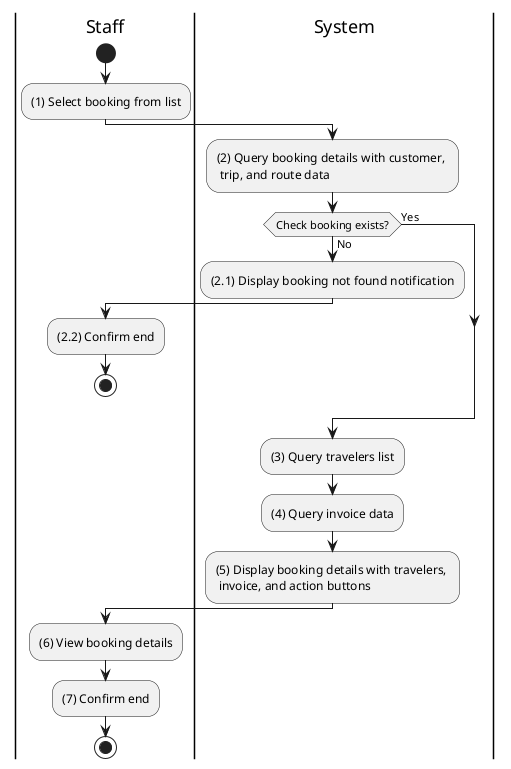

# Activity View Booking Details

```plantuml
@startuml
|St|Staff
|S|System

|St|
start

:(1) Select booking from list;

|S|
:(2) Query booking details with customer, \n trip, and route data;

if (Check booking exists?) then (No)
  :(2.1) Display booking not found notification;
  |St|
  :(2.2) Confirm end;
  stop
else (Yes)
endif

|S|
:(3) Query travelers list;
:(4) Query invoice data;
:(5) Display booking details with travelers, \n invoice, and action buttons;

|St|
:(6) View booking details;
:(7) Confirm end;

stop

@enduml
```

<!-- diagram id="activity-adjust-and-track-bookings-view-booking-details" -->
