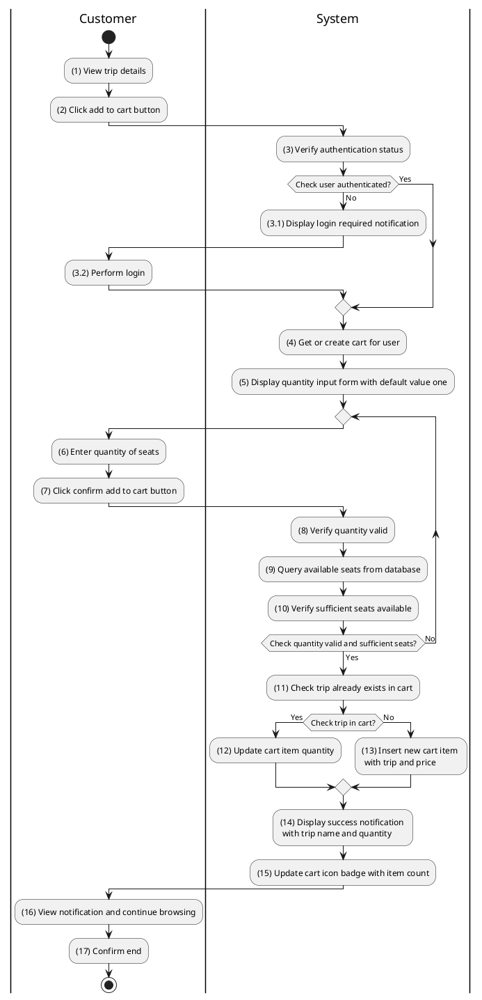

# Activity Add Trip to Cart

```plantuml
@startuml
|C|Customer
|S|System

|C|
start

:(1) View trip details;

:(2) Click add to cart button;

|S|
:(3) Verify authentication status;

if (Check user authenticated?) then (No)
  :(3.1) Display login required notification;

  |C|
  :(3.2) Perform login;

  |S|
else (Yes)
endif

:(4) Get or create cart for user;

:(5) Display quantity input form with default value one;

repeat
  |C|
  :(6) Enter quantity of seats;

  :(7) Click confirm add to cart button;

  |S|
  :(8) Verify quantity valid;

  :(9) Query available seats from database;

  :(10) Verify sufficient seats available;
repeat while (Check quantity valid and sufficient seats?) is (No) not (Yes)

:(11) Check trip already exists in cart;

if (Check trip in cart?) then (Yes)
  :(12) Update cart item quantity;
else (No)
  :(13) Insert new cart item \n with trip and price;
endif

:(14) Display success notification \n with trip name and quantity;

:(15) Update cart icon badge with item count;

|C|
:(16) View notification and continue browsing;

:(17) Confirm end;

stop

@enduml
```

<!-- diagram id="activity-adjust-cart-add-trip-to-cart" -->
