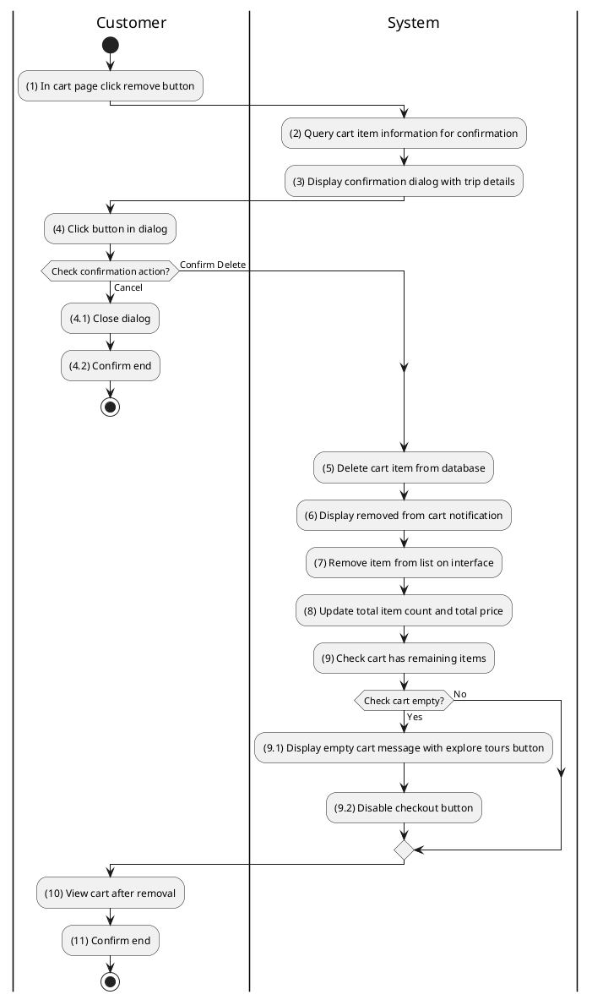

# Activity Remove Trip from Cart

```plantuml
@startuml
|C|Customer
|S|System

|C|
start

:(1) In cart page click remove button;

|S|
:(2) Query cart item information for confirmation;

:(3) Display confirmation dialog with trip details;

|C|
:(4) Click button in dialog;

if (Check confirmation action?) then (Cancel)
  :(4.1) Close dialog;

  :(4.2) Confirm end;

  stop
else (Confirm Delete)
endif

|S|
:(5) Delete cart item from database;

:(6) Display removed from cart notification;

:(7) Remove item from list on interface;

:(8) Update total item count and total price;

:(9) Check cart has remaining items;

if (Check cart empty?) then (Yes)
  :(9.1) Display empty cart message with explore tours button;

  :(9.2) Disable checkout button;
else (No)
endif

|C|
:(10) View cart after removal;

:(11) Confirm end;

stop

@enduml
```

<!-- diagram id="activity-adjust-cart-remove-trip-to-cart" -->
