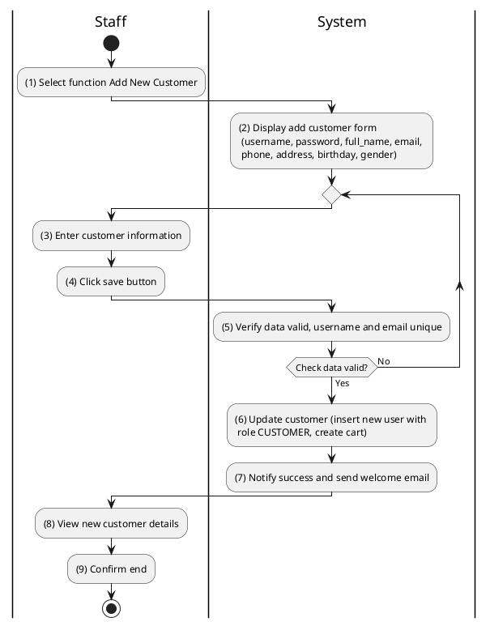

# Activity Add New Customer

```plantuml
@startuml
|St|Staff
|S|System

|St|
start

:(1) Select function Add New Customer;

|S|
:(2) Display add customer form \n (username, password, full_name, email, \n phone, address, birthday, gender);

repeat
  |St|
  :(3) Enter customer information;
  :(4) Click save button;

  |S|
  :(5) Verify data valid, username and email unique;
repeat while (Check data valid?) is (No) not (Yes)

|S|
:(6) Update customer (insert new user with \n role CUSTOMER, create cart);
:(7) Notify success and send welcome email;

|St|
:(8) View new customer details;
:(9) Confirm end;

stop

@enduml
```

<!-- diagram id="activity-adjust-customers-add-new-customer" -->
