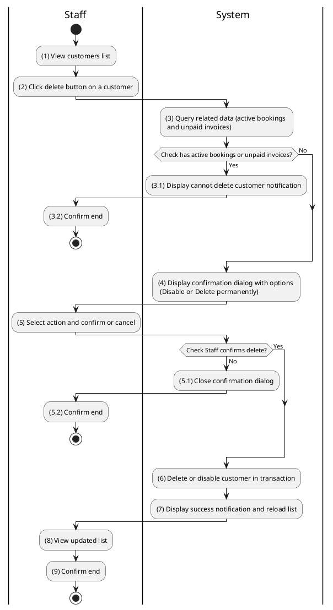

# Activity Delete Customer

```plantuml
@startuml
|St|Staff
|S|System

|St|
start

:(1) View customers list;
:(2) Click delete button on a customer;

|S|
:(3) Query related data (active bookings \n and unpaid invoices);

if (Check has active bookings or unpaid invoices?) then (Yes)
  :(3.1) Display cannot delete customer notification;
  |St|
  :(3.2) Confirm end;
  stop
else (No)
endif

|S|
:(4) Display confirmation dialog with options \n (Disable or Delete permanently);

|St|
:(5) Select action and confirm or cancel;

|S|
if (Check Staff confirms delete?) then (No)
  :(5.1) Close confirmation dialog;
  |St|
  :(5.2) Confirm end;
  stop
else (Yes)
endif

|S|
:(6) Delete or disable customer in transaction;
:(7) Display success notification and reload list;

|St|
:(8) View updated list;
:(9) Confirm end;

stop

@enduml
```

<!-- diagram id="activity-adjust-customers-delete-customer" -->
