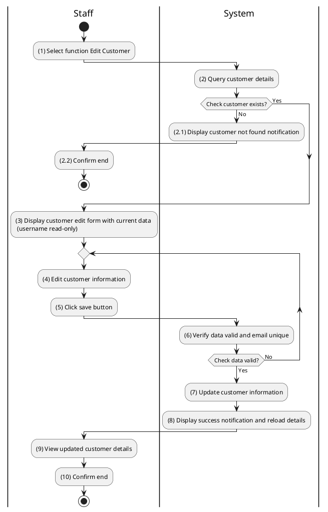

# Activity Edit Customer

```plantuml
@startuml
|St|Staff
|S|System

|St|
start

:(1) Select function Edit Customer;

|S|
:(2) Query customer details;

if (Check customer exists?) then (No)
  :(2.1) Display customer not found notification;
  |St|
  :(2.2) Confirm end;
  stop
else (Yes)
endif

:(3) Display customer edit form with current data \n (username read-only);

repeat
  |St|
  :(4) Edit customer information;
  :(5) Click save button;
  |S|
  :(6) Verify data valid and email unique;
repeat while (Check data valid?) is (No) not (Yes)

|S|
:(7) Update customer information;
:(8) Display success notification and reload details;

|St|
:(9) View updated customer details;
:(10) Confirm end;

stop

@enduml
```

<!-- diagram id="activity-adjust-customers-edit-customer" -->
