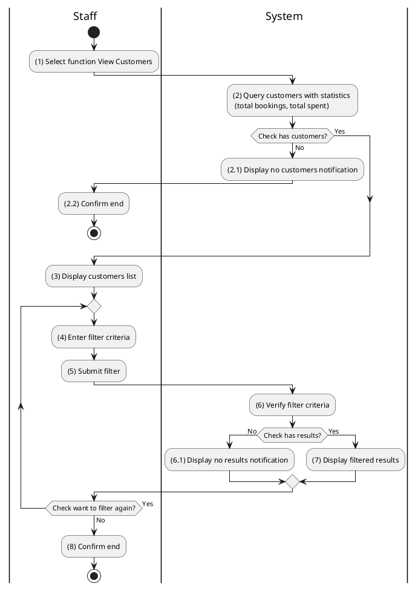

# Activity View and Filter Customers

```plantuml
@startuml
|St|Staff
|S|System

|St|
start

:(1) Select function View Customers;

|S|
:(2) Query customers with statistics \n (total bookings, total spent);

if (Check has customers?) then (No)
  :(2.1) Display no customers notification;
  |St|
  :(2.2) Confirm end;
  stop
else (Yes)
endif

:(3) Display customers list;

repeat
  |St|
  :(4) Enter filter criteria;
  :(5) Submit filter;

  |S|
  :(6) Verify filter criteria;

  if (Check has results?) then (No)
    :(6.1) Display no results notification;
    |St|
  else (Yes)
    |S|
    :(7) Display filtered results;
    |St|
  endif
repeat while (Check want to filter again?) is (Yes) not (No)

:(8) Confirm end;

stop

@enduml
```

<!-- diagram id="activity-adjust-customers-view-and-filter-customers" -->
