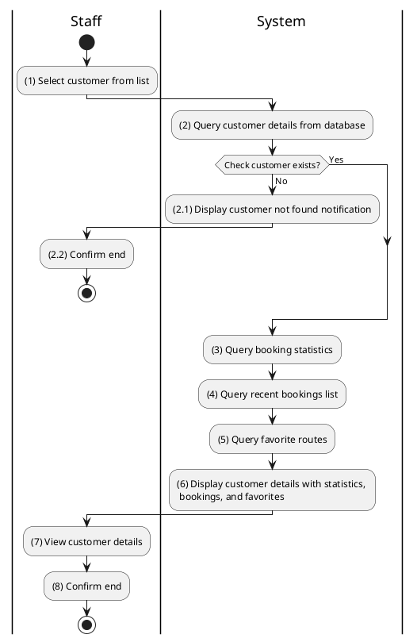

# Activity View Customer Details

```plantuml
@startuml
|St|Staff
|S|System

|St|
start

:(1) Select customer from list;

|S|
:(2) Query customer details from database;

if (Check customer exists?) then (No)
  :(2.1) Display customer not found notification;
  |St|
  :(2.2) Confirm end;
  stop
else (Yes)
endif

|S|
:(3) Query booking statistics;
:(4) Query recent bookings list;
:(5) Query favorite routes;
:(6) Display customer details with statistics, \n bookings, and favorites;

|St|
:(7) View customer details;
:(8) Confirm end;

stop

@enduml
```

<!-- diagram id="activity-adjust-customers-view-customer-details" -->
