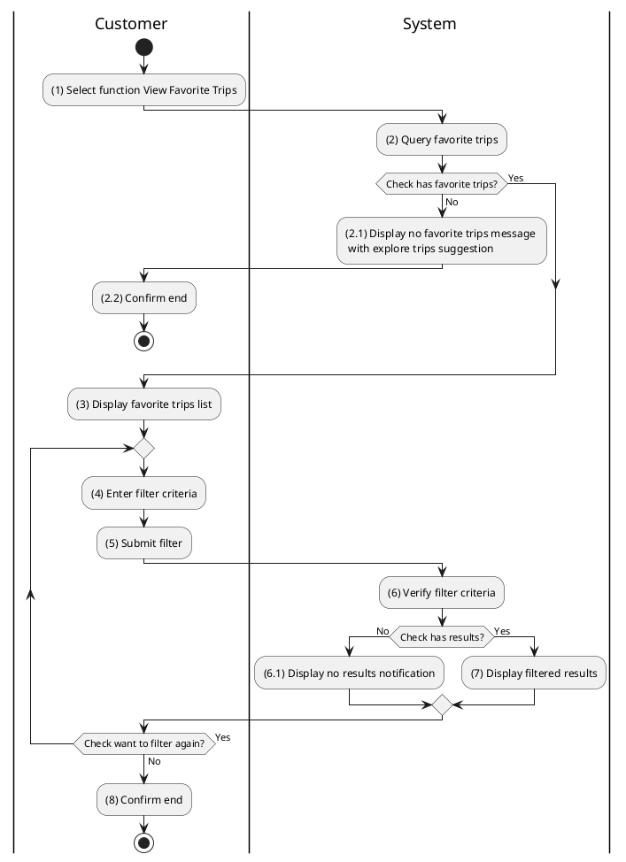

# Activity View and Filter Favorite Trips

```plantuml
@startuml
|C|Customer
|S|System

|C|
start

:(1) Select function View Favorite Trips;

|S|
:(2) Query favorite trips;

if (Check has favorite trips?) then (No)
  :(2.1) Display no favorite trips message \n with explore trips suggestion;
  |C|
  :(2.2) Confirm end;
  stop
else (Yes)
endif

:(3) Display favorite trips list;

repeat
  |C|
  :(4) Enter filter criteria;
  :(5) Submit filter;

  |S|
  :(6) Verify filter criteria;

  if (Check has results?) then (No)
    :(6.1) Display no results notification;
    |C|
  else (Yes)
    |S|
    :(7) Display filtered results;
    |C|
  endif
repeat while (Check want to filter again?) is (Yes) not (No)

:(8) Confirm end;

stop

@enduml

<!-- diagram id="activity-adjust-favorite-trips-view-and-filter-favorite-trips" -->
```
