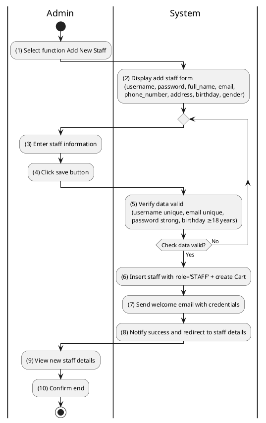

# Activity Add New Staff

```plantuml
@startuml
|A|Admin
|S|System

|A|
start

:(1) Select function Add New Staff;

|S|
:(2) Display add staff form \n (username, password, full_name, email, \n phone_number, address, birthday, gender);

repeat
  |A|
  :(3) Enter staff information;
  :(4) Click save button;

  |S|
  :(5) Verify data valid \n (username unique, email unique, \n password strong, birthday ≥18 years);
repeat while (Check data valid?) is (No) not (Yes)

|S|
:(6) Insert staff with role='STAFF' + create Cart;
:(7) Send welcome email with credentials;
:(8) Notify success and redirect to staff details;

|A|
:(9) View new staff details;
:(10) Confirm end;

stop

@enduml
```

<!-- diagram id="activity-adjust-staffs-add-new-staff" -->
