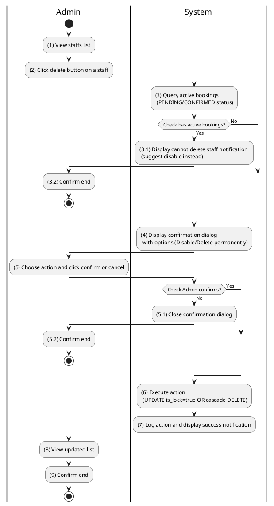

# Activity Delete Staff

```plantuml
@startuml
|A|Admin
|S|System

|A|
start

:(1) View staffs list;
:(2) Click delete button on a staff;

|S|
:(3) Query active bookings \n (PENDING/CONFIRMED status);

if (Check has active bookings?) then (Yes)
  :(3.1) Display cannot delete staff notification \n (suggest disable instead);
  |A|
  :(3.2) Confirm end;
  stop
else (No)
endif

|S|
:(4) Display confirmation dialog \n with options (Disable/Delete permanently);

|A|
:(5) Choose action and click confirm or cancel;

|S|
if (Check Admin confirms?) then (No)
  :(5.1) Close confirmation dialog;
  |A|
  :(5.2) Confirm end;
  stop
else (Yes)
endif

|S|
:(6) Execute action \n (UPDATE is_lock=true OR cascade DELETE);
:(7) Log action and display success notification;

|A|
:(8) View updated list;
:(9) Confirm end;

stop

@enduml
```

<!-- diagram id="activity-adjust-staffs-delete-staff" -->
