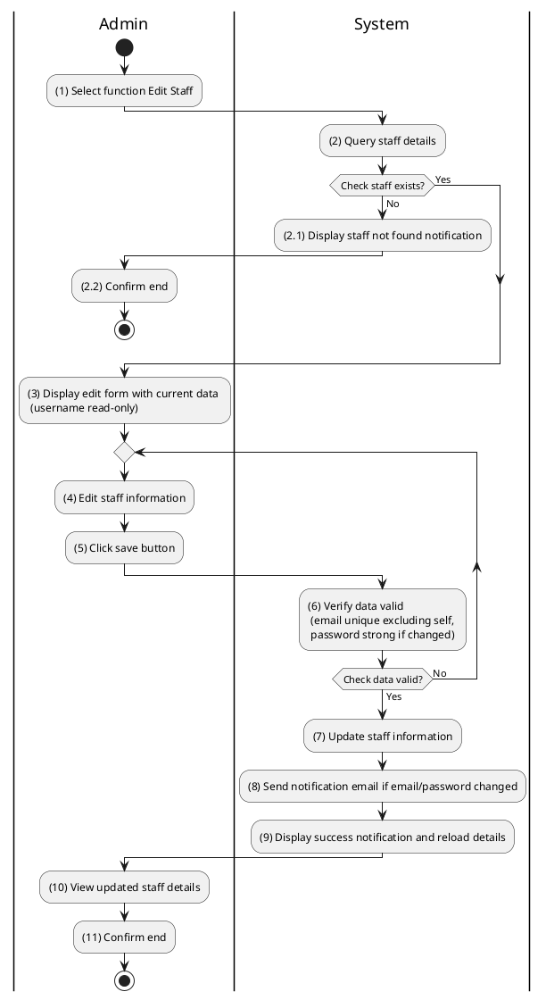

# Activity Edit Staff

```plantuml
@startuml
|A|Admin
|S|System

|A|
start

:(1) Select function Edit Staff;

|S|
:(2) Query staff details;

if (Check staff exists?) then (No)
  :(2.1) Display staff not found notification;
  |A|
  :(2.2) Confirm end;
  stop
else (Yes)
endif

:(3) Display edit form with current data \n (username read-only);

repeat
  |A|
  :(4) Edit staff information;
  :(5) Click save button;
  |S|
  :(6) Verify data valid \n (email unique excluding self, \n password strong if changed);
repeat while (Check data valid?) is (No) not (Yes)

|S|
:(7) Update staff information;
:(8) Send notification email if email/password changed;
:(9) Display success notification and reload details;

|A|
:(10) View updated staff details;
:(11) Confirm end;

stop

@enduml
```

<!-- diagram id="activity-adjust-staffs-edit-staff" -->
