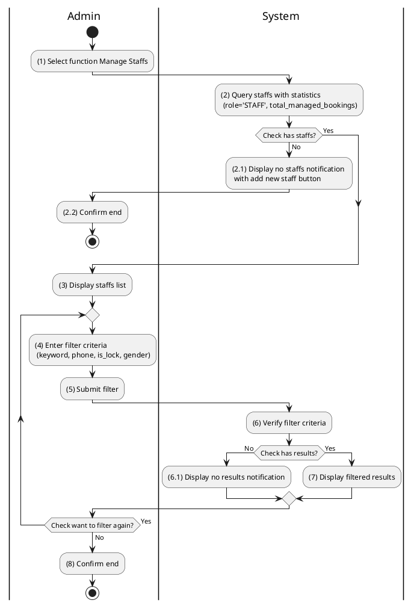

# Activity View and Filter Staffs

```plantuml
@startuml
|A|Admin
|S|System

|A|
start

:(1) Select function Manage Staffs;

|S|
:(2) Query staffs with statistics \n (role='STAFF', total_managed_bookings);

if (Check has staffs?) then (No)
  :(2.1) Display no staffs notification \n with add new staff button;
  |A|
  :(2.2) Confirm end;
  stop
else (Yes)
endif

:(3) Display staffs list;

repeat
  |A|
  :(4) Enter filter criteria \n (keyword, phone, is_lock, gender);
  :(5) Submit filter;

  |S|
  :(6) Verify filter criteria;

  if (Check has results?) then (No)
    :(6.1) Display no results notification;
    |A|
  else (Yes)
    |S|
    :(7) Display filtered results;
    |A|
  endif
repeat while (Check want to filter again?) is (Yes) not (No)

:(8) Confirm end;

stop

@enduml
```

<!-- diagram id="activity-adjust-staffs-view-and-filter-staffs" -->
