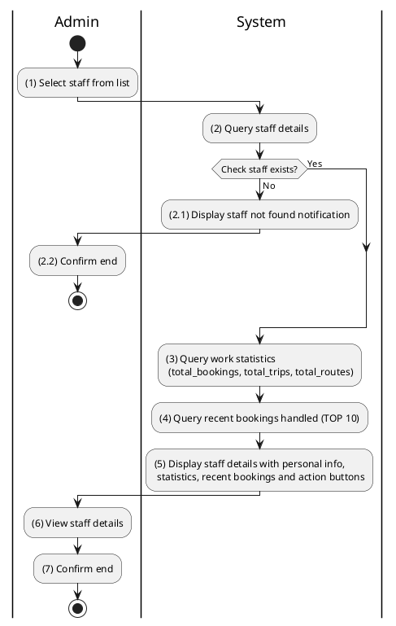

# Activity View Staff Details

```plantuml
@startuml
|A|Admin
|S|System

|A|
start

:(1) Select staff from list;

|S|
:(2) Query staff details;

if (Check staff exists?) then (No)
  :(2.1) Display staff not found notification;
  |A|
  :(2.2) Confirm end;
  stop
else (Yes)
endif

|S|
:(3) Query work statistics \n (total_bookings, total_trips, total_routes);
:(4) Query recent bookings handled (TOP 10);
:(5) Display staff details with personal info, \n statistics, recent bookings and action buttons;

|A|
:(6) View staff details;
:(7) Confirm end;

stop

@enduml
```

<!-- diagram id="activity-adjust-staffs-view-staff-details" -->
