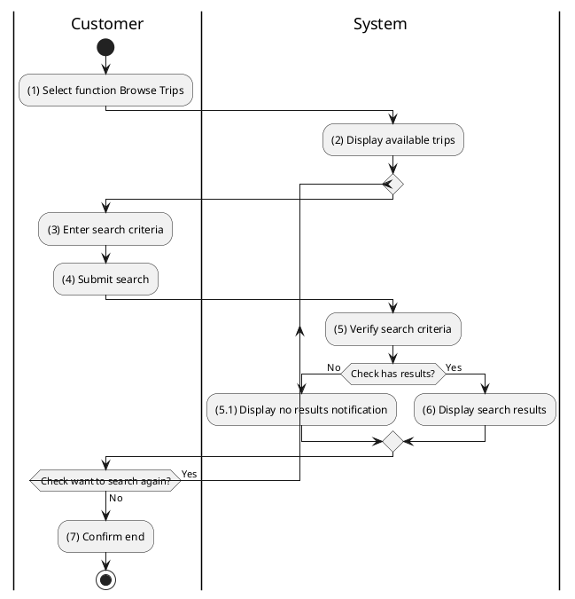

# Activity View and Filter Available Trips

```plantuml
@startuml
|C|Customer
|S|System

|C|
start

:(1) Select function Browse Trips;

|S|
:(2) Display available trips;

repeat
  |C|
  :(3) Enter search criteria;
  :(4) Submit search;

  |S|
  :(5) Verify search criteria;

  if (Check has results?) then (No)
    :(5.1) Display no results notification;
    |C|
  else (Yes)
    |S|
    :(6) Display search results;

    |C|
  endif
repeat while (Check want to search again?) is (Yes) not (No)

:(7) Confirm end;

stop

@enduml
```

<!-- diagram id="activity-browse-trips-view-and-filter-available-trips" -->

<!-- diagram id="activity-browse-trips-view-and-filter-available-trips" -->
