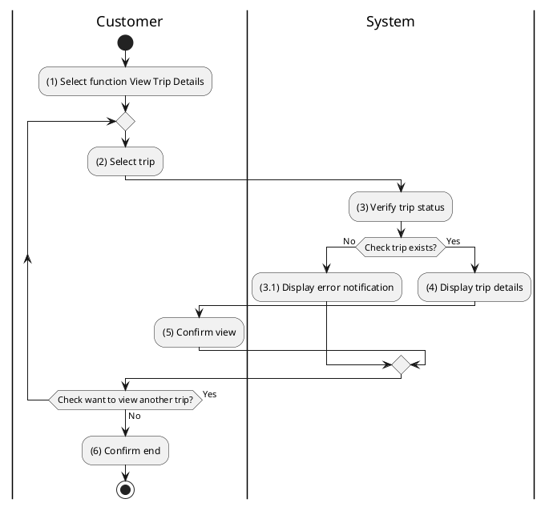

# Activity View Trip Details

```plantuml
@startuml
|C|Customer
|S|System

|C|
start

:(1) Select function View Trip Details;

repeat
  :(2) Select trip;

  |S|
  :(3) Verify trip status;

  if (Check trip exists?) then (No)
    :(3.1) Display error notification;
    |C|
  else (Yes)
    |S|
    :(4) Display trip details;

    |C|
    :(5) Confirm view;
  endif
repeat while (Check want to view another trip?) is (Yes) not (No)

:(6) Confirm end;

stop

@enduml
```

<!-- diagram id="activity-browse-trips-view-trip-details" -->

<!-- diagram id="activity-browse-trips-view-trip-details" -->
