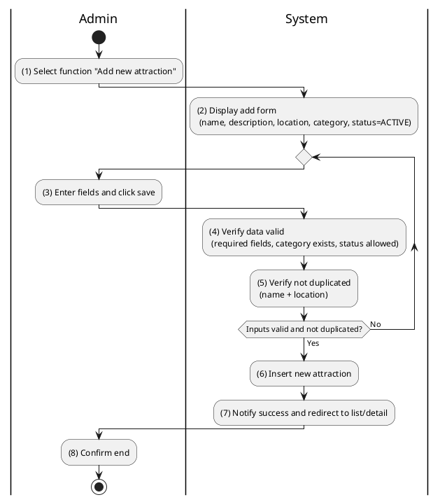

# Activity Add New Attraction

```plantuml
@startuml
|A|Admin
|S|System

|A|
start

:(1) Select function "Add new attraction";

|S|
:(2) Display add form
 (name, description, location, category, status=ACTIVE);

repeat
	|A|
	:(3) Enter fields and click save;
	|S|
	:(4) Verify data valid
	 (required fields, category exists, status allowed);
	:(5) Verify not duplicated
	 (name + location);
repeat while (Inputs valid and not duplicated?) is (No) not (Yes)

|S|
:(6) Insert new attraction;
:(7) Notify success and redirect to list/detail;

|A|
:(8) Confirm end;
stop

@enduml
```

<!-- diagram id="activity-manage-attraction-add-new-attraction" -->
