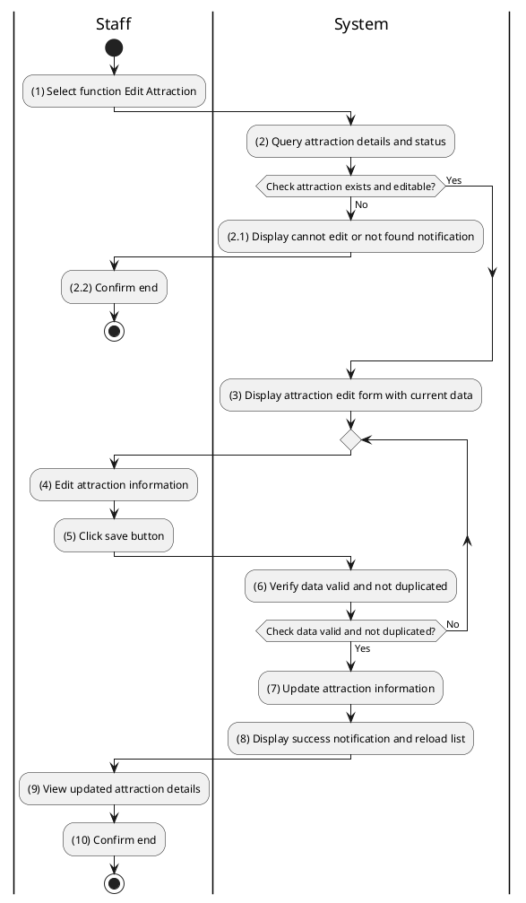

# Activity Edit Attraction

```plantuml
@startuml
|S|Staff
|Sy|System

|S|
start

:(1) Select function Edit Attraction;

|Sy|
:(2) Query attraction details and status;

if (Check attraction exists and editable?) then (No)
	:(2.1) Display cannot edit or not found notification;
	|S|
	:(2.2) Confirm end;
	stop
else (Yes)
endif

|Sy|
:(3) Display attraction edit form with current data;

repeat
	|S|
	:(4) Edit attraction information;
	:(5) Click save button;
	|Sy|
	:(6) Verify data valid and not duplicated;
repeat while (Check data valid and not duplicated?) is (No) not (Yes)

|Sy|
:(7) Update attraction information;
:(8) Display success notification and reload list;

|S|
:(9) View updated attraction details;
:(10) Confirm end;

stop

@enduml
```

<!-- diagram id="activity-manage-attraction-edit-attraction" -->
