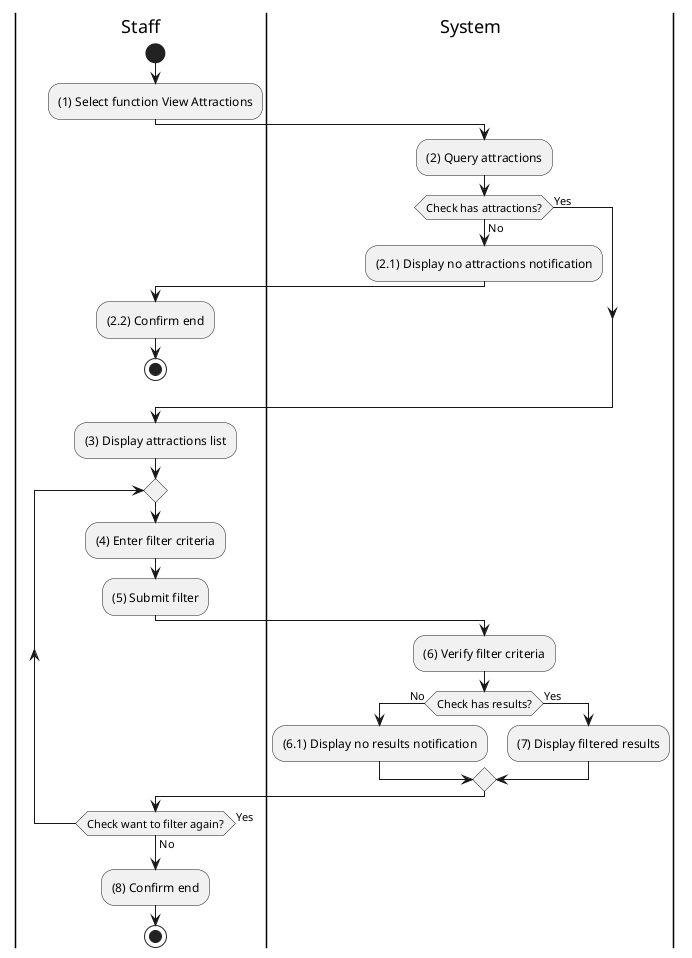

# Activity View and Filter Attractions

```plantuml
@startuml
|S|Staff
|Sy|System

|S|
start

:(1) Select function View Attractions;

|Sy|
:(2) Query attractions;

if (Check has attractions?) then (No)
	:(2.1) Display no attractions notification;
	|S|
	:(2.2) Confirm end;
	stop
else (Yes)
endif

:(3) Display attractions list;

repeat
	|S|
	:(4) Enter filter criteria;
	:(5) Submit filter;

	|Sy|
	:(6) Verify filter criteria;

	if (Check has results?) then (No)
		:(6.1) Display no results notification;
		|S|
	else (Yes)
		|Sy|
		:(7) Display filtered results;
		|S|
	endif
repeat while (Check want to filter again?) is (Yes) not (No)

:(8) Confirm end;

stop

@enduml

<!-- diagram id="activity-manage-attraction-view-and-filter-attractions" -->
```
