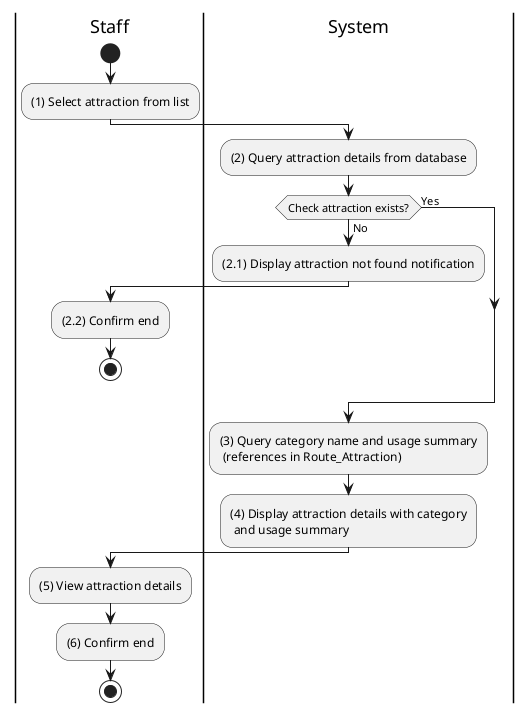

# Activity View Attraction Detail

```plantuml
@startuml
|S|Staff
|Sy|System

|S|
start

:(1) Select attraction from list;

|Sy|
:(2) Query attraction details from database;

if (Check attraction exists?) then (No)
	:(2.1) Display attraction not found notification;
	|S|
	:(2.2) Confirm end;
	stop
else (Yes)
endif

|Sy|
:(3) Query category name and usage summary
 (references in Route_Attraction);

:(4) Display attraction details with category
 and usage summary;

|S|
:(5) View attraction details;
:(6) Confirm end;

stop

@enduml
```

<!-- diagram id="activity-manage-attraction-view-attraction-detail" -->
