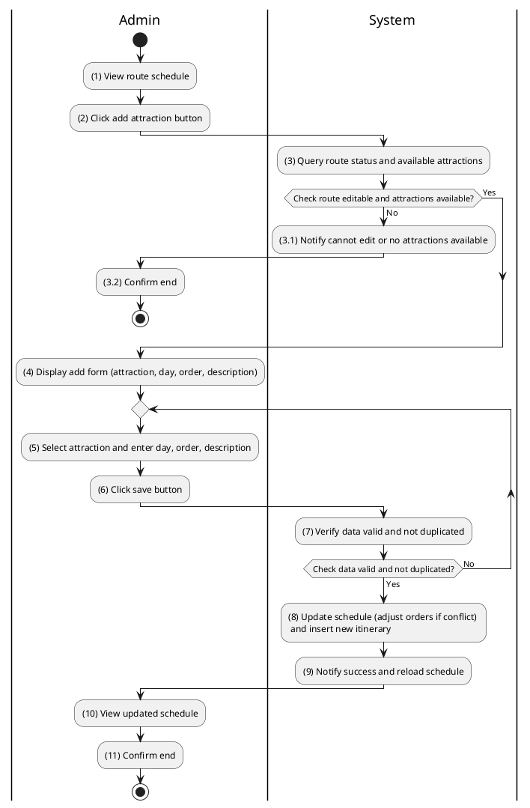

# Activity Add Itinerary

```plantuml
@startuml
|A|Admin
|S|System

|A|
start

:(1) View route schedule;
:(2) Click add attraction button;

|S|
:(3) Query route status and available attractions;

if (Check route editable and attractions available?) then (No)
  :(3.1) Notify cannot edit or no attractions available;
  |A|
  :(3.2) Confirm end;
  stop
else (Yes)
endif

:(4) Display add form (attraction, day, order, description);

repeat
  |A|
  :(5) Select attraction and enter day, order, description;
  :(6) Click save button;
  |S|
  :(7) Verify data valid and not duplicated;
repeat while (Check data valid and not duplicated?) is (No) not (Yes)

|S|
:(8) Update schedule (adjust orders if conflict) \n and insert new itinerary;
:(9) Notify success and reload schedule;

|A|
:(10) View updated schedule;
:(11) Confirm end;

stop

@enduml
```

<!-- diagram id="activity-manage-route-schedule-add-itinerary" -->
