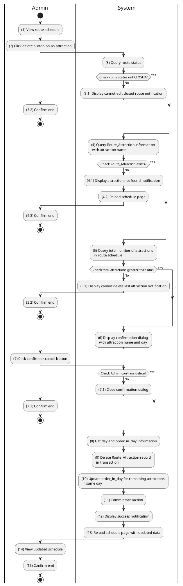

# Activity Delete Itinerary

```plantuml
@startuml
|A|Admin
|S|System

|A|
start

:(1) View route schedule;

:(2) Click delete button on an attraction;

|S|
:(3) Query route status;

if (Check route status not CLOSED?) then (No)
  :(3.1) Display cannot edit closed route notification;

  |A|
  :(3.2) Confirm end;

  stop
else (Yes)
endif

|S|
:(4) Query Route_Attraction information \n with attraction name;

if (Check Route_Attraction exists?) then (No)
  :(4.1) Display attraction not found notification;

  :(4.2) Reload schedule page;

  |A|
  :(4.3) Confirm end;

  stop
else (Yes)
endif

|S|
:(5) Query total number of attractions \n in route schedule;

if (Check total attractions greater than one?) then (No)
  :(5.1) Display cannot delete last attraction notification;

  |A|
  :(5.2) Confirm end;

  stop
else (Yes)
endif

|S|
:(6) Display confirmation dialog \n with attraction name and day;

|A|
:(7) Click confirm or cancel button;

|S|
if (Check Admin confirms delete?) then (No)
  :(7.1) Close confirmation dialog;

  |A|
  :(7.2) Confirm end;

  stop
else (Yes)
endif

|S|
:(8) Get day and order_in_day information;

:(9) Delete Route_Attraction record \n in transaction;

:(10) Update order_in_day for remaining attractions \n in same day;

:(11) Commit transaction;

:(12) Display success notification;

:(13) Reload schedule page with updated data;

|A|
:(14) View updated schedule;

:(15) Confirm end;

stop

@enduml
```

<!-- diagram id="activity-manage-route-schedule-delete-itinerary" -->
