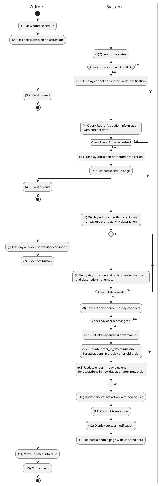

# Activity Edit Itinerary

```plantuml
@startuml
|A|Admin
|S|System

|A|
start

:(1) View route schedule;

:(2) Click edit button on an attraction;

|S|
:(3) Query route status;

if (Check route status not CLOSED?) then (No)
  :(3.1) Display cannot edit closed route notification;

  |A|
  :(3.2) Confirm end;

  stop
else (Yes)
endif

|S|
:(4) Query Route_Attraction information \n with current data;

if (Check Route_Attraction exists?) then (No)
  :(4.1) Display attraction not found notification;

  :(4.2) Reload schedule page;

  |A|
  :(4.3) Confirm end;

  stop
else (Yes)
endif

|S|
:(5) Display edit form with current data \n for day order and activity description;

repeat
  |A|
  :(6) Edit day or order or activity description;

  :(7) Click save button;

  |S|
  :(8) Verify day in range and order greater than zero \n and description not empty;
repeat while (Check all data valid?) is (No) not (Yes)

|S|
:(9) Check if day or order_in_day changed;

if (Check day or order changed?) then (Yes)
  :(9.1) Get old day and old order values;

  :(9.2) Update order_in_day minus one \n for attractions in old day after old order;

  :(9.3) Update order_in_day plus one \n for attractions in new day at or after new order;
else (No)
endif

|S|
:(10) Update Route_Attraction with new values;

:(11) Commit transaction;

:(12) Display success notification;

:(13) Reload schedule page with updated data;

|A|
:(14) View updated schedule;

:(15) Confirm end;

stop

@enduml
```

<!-- diagram id="activity-manage-route-schedule-edit-itinerary" -->
