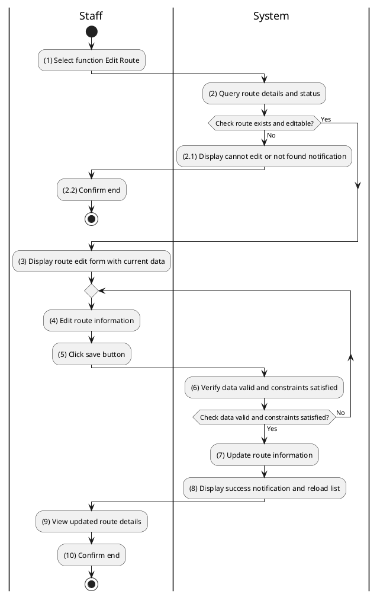

# Activity Edit Route Details

```plantuml
@startuml
|S|Staff
|Sy|System

|S|
start

:(1) Select function Edit Route;

|Sy|
:(2) Query route details and status;

if (Check route exists and editable?) then (No)
  :(2.1) Display cannot edit or not found notification;
  |S|
  :(2.2) Confirm end;
  stop
else (Yes)
endif

:(3) Display route edit form with current data;

repeat
  |S|
  :(4) Edit route information;
  :(5) Click save button;
  |Sy|
  :(6) Verify data valid and constraints satisfied;
repeat while (Check data valid and constraints satisfied?) is (No) not (Yes)

|Sy|
:(7) Update route information;
:(8) Display success notification and reload list;

|S|
:(9) View updated route details;
:(10) Confirm end;

stop

@enduml
```

<!-- diagram id="activity-manage-routes-edit-route-details" -->
