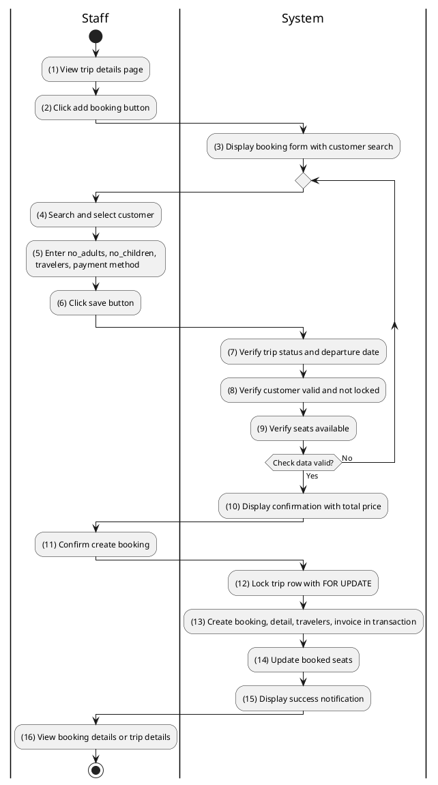

# Activity Add New Booking for Trip

```plantuml
@startuml
|St|Staff
|S|System

|St|
start
:(1) View trip details page;
:(2) Click add booking button;

|S|
:(3) Display booking form with customer search;

repeat
  |St|
  :(4) Search and select customer;
  :(5) Enter no_adults, no_children, \n travelers, payment method;
  :(6) Click save button;
  |S|
  :(7) Verify trip status and departure date;
  :(8) Verify customer valid and not locked;
  :(9) Verify seats available;
repeat while (Check data valid?) is (No) not (Yes)

:(10) Display confirmation with total price;

|St|
:(11) Confirm create booking;

|S|
:(12) Lock trip row with FOR UPDATE;
:(13) Create booking, detail, travelers, invoice in transaction;
:(14) Update booked seats;
:(15) Display success notification;

|St|
:(16) View booking details or trip details;

stop

@enduml
```

<!-- diagram id="activity-manage-trips-add-new-booking-for-trip" -->
