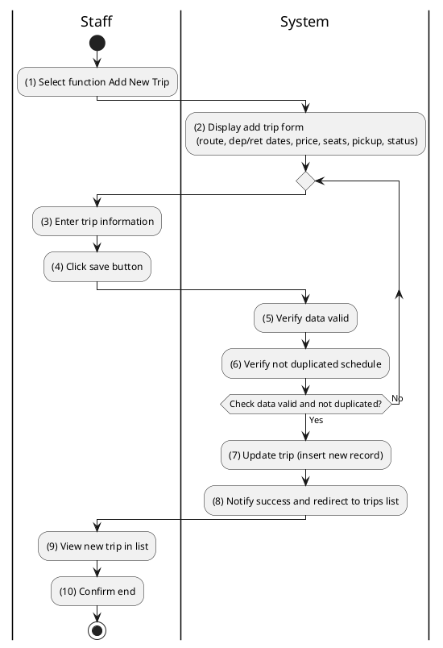

# Activity Add New Trip

```plantuml
@startuml
|S|Staff
|Sy|System

|S|
start

:(1) Select function Add New Trip;

|Sy|
:(2) Display add trip form \n (route, dep/ret dates, price, seats, pickup, status);

repeat
	|S|
	:(3) Enter trip information;
	:(4) Click save button;

	|Sy|
	:(5) Verify data valid;
	:(6) Verify not duplicated schedule;
repeat while (Check data valid and not duplicated?) is (No) not (Yes)

|Sy|
:(7) Update trip (insert new record);
:(8) Notify success and redirect to trips list;

|S|
:(9) View new trip in list;
:(10) Confirm end;

stop

@enduml
```

<!-- diagram id="activity-manage-trips-add-new-trip" -->
