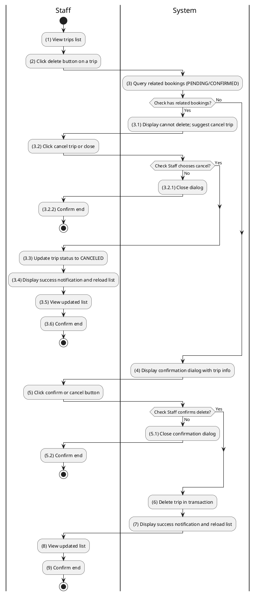

# Activity Delete Trip

```plantuml
@startuml
|S|Staff
|Sy|System

|S|
start

:(1) View trips list;
:(2) Click delete button on a trip;

|Sy|
:(3) Query related bookings (PENDING/CONFIRMED);

if (Check has related bookings?) then (Yes)
	:(3.1) Display cannot delete; suggest cancel trip;
	|S|
	:(3.2) Click cancel trip or close;
	|Sy|
	if (Check Staff chooses cancel?) then (No)
		:(3.2.1) Close dialog;
		|S|
		:(3.2.2) Confirm end;
		stop
	else (Yes)
	endif
	:(3.3) Update trip status to CANCELED;
	:(3.4) Display success notification and reload list;
	|S|
	:(3.5) View updated list;
	:(3.6) Confirm end;
	stop
else (No)
endif

|Sy|
:(4) Display confirmation dialog with trip info;

|S|
:(5) Click confirm or cancel button;

|Sy|
if (Check Staff confirms delete?) then (No)
	:(5.1) Close confirmation dialog;
	|S|
	:(5.2) Confirm end;
	stop
else (Yes)
endif

|Sy|
:(6) Delete trip in transaction;
:(7) Display success notification and reload list;

|S|
:(8) View updated list;
:(9) Confirm end;

stop

@enduml
```

<!-- diagram id="activity-manage-trips-delete-trip" -->
