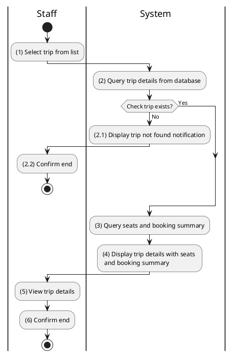

# Activity View Trip Detail

```plantuml
@startuml
|St|Staff
|S|System

|St|
start

:(1) Select trip from list;

|S|
:(2) Query trip details from database;

if (Check trip exists?) then (No)
	:(2.1) Display trip not found notification;
	|St|
	:(2.2) Confirm end;
	stop
else (Yes)
endif

|S|
:(3) Query seats and booking summary;

:(4) Display trip details with seats \n and booking summary;

|St|
:(5) View trip details;
:(6) Confirm end;

stop

@enduml
```

<!-- diagram id="activity-manage-trips-view-trip-details" -->
