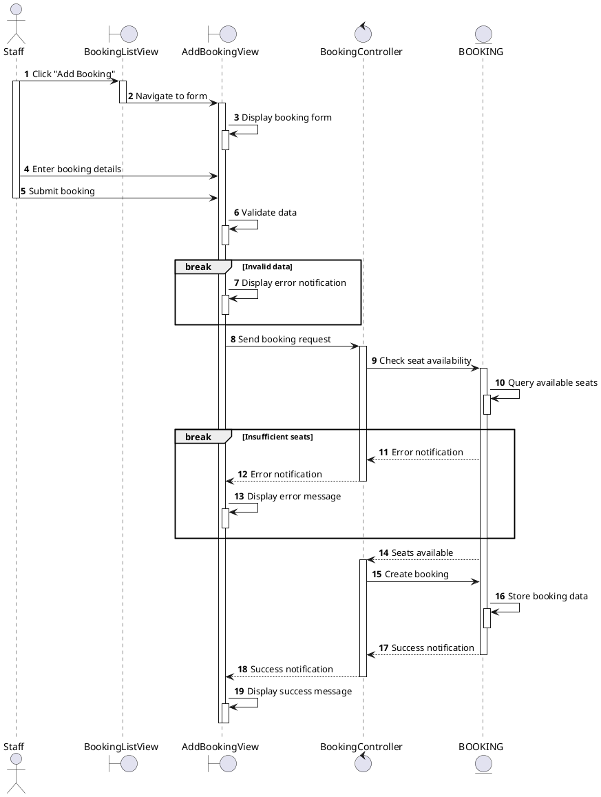

# Sequence Add New Booking

```plantuml
@startuml
autonumber

actor Staff as S
boundary BookingListView as BLV
boundary AddBookingView as ABV
control BookingController as BC
entity BOOKING as B

S -> BLV: Click "Add Booking"
activate S
activate BLV
BLV -> ABV: Navigate to form
deactivate BLV
activate ABV
ABV -> ABV: Display booking form
activate ABV
deactivate ABV

S -> ABV: Enter booking details
S -> ABV: Submit booking
deactivate S
ABV -> ABV: Validate data
activate ABV
deactivate ABV

break Invalid data
  ABV -> ABV: Display error notification
  activate ABV
  deactivate ABV
end

ABV -> BC: Send booking request
activate BC
BC -> B: Check seat availability
activate B
B -> B: Query available seats
activate B
deactivate B

break Insufficient seats
  BC <-- B: Error notification
  ABV <-- BC: Error notification
  deactivate BC
  ABV -> ABV: Display error message
  activate ABV
  deactivate ABV
end


BC <-- B: Seats available
activate BC
BC -> B: Create booking
B -> B: Store booking data
activate B
deactivate B
BC <-- B: Success notification
deactivate B
ABV <-- BC: Success notification
deactivate BC
ABV -> ABV: Display success message
activate ABV
deactivate ABV
deactivate ABV

@enduml
```

<!-- diagram id="sequence-adjust-and-track-bookings-add-new-booking" -->
