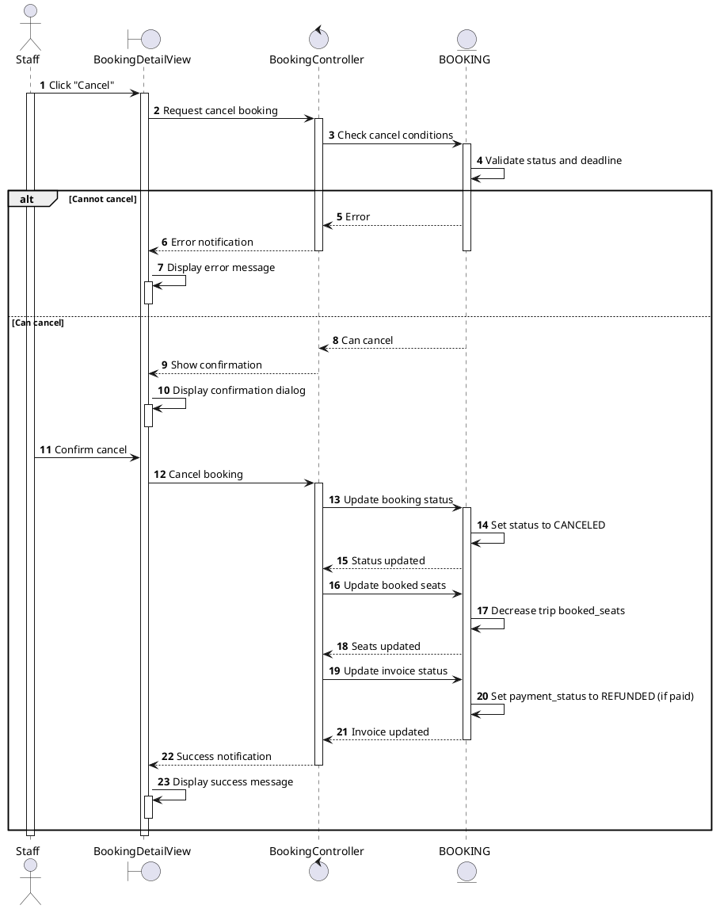

# Sequence Delete Booking

```plantuml
@startuml
autonumber

actor Staff as S
boundary BookingDetailView as BDV
control BookingController as BC
entity BOOKING as B

S -> BDV: Click "Cancel"
activate S
activate BDV
BDV -> BC: Request cancel booking
activate BC
BC -> B: Check cancel conditions
activate B
B -> B: Validate status and deadline

alt Cannot cancel
  BC <-- B: Error
  BDV <-- BC: Error notification
  deactivate BC
  deactivate B
  BDV -> BDV: Display error message
  activate BDV
  deactivate BDV
else Can cancel
  BC <-- B: Can cancel
  deactivate B
  BDV <-- BC: Show confirmation
  deactivate BC
  BDV -> BDV: Display confirmation dialog
  activate BDV
  deactivate BDV

  S -> BDV: Confirm cancel
  BDV -> BC: Cancel booking
  activate BC
  BC -> B: Update booking status
  activate B
  B -> B: Set status to CANCELED
  BC <-- B: Status updated
  BC -> B: Update booked seats
  B -> B: Decrease trip booked_seats
  BC <-- B: Seats updated
  BC -> B: Update invoice status
  B -> B: Set payment_status to REFUNDED (if paid)
  BC <-- B: Invoice updated
  deactivate B
  BDV <-- BC: Success notification
  deactivate BC
  BDV -> BDV: Display success message
  activate BDV
  deactivate BDV
end

deactivate BDV
deactivate S

@enduml
```

<!-- diagram id="sequence-adjust-and-track-bookings-delete-booking" -->
