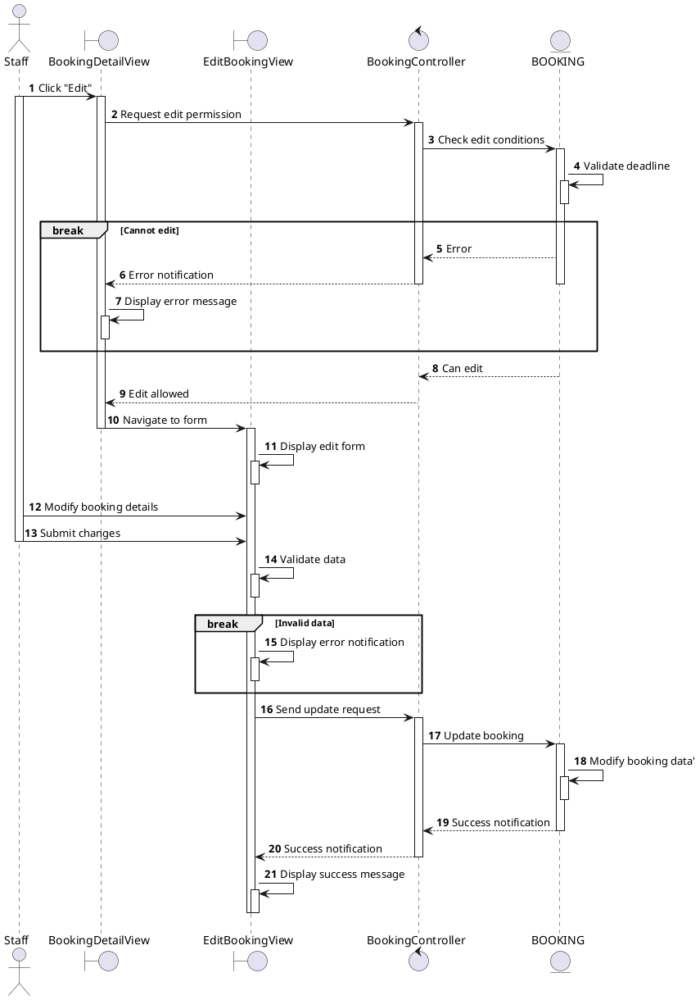

# Sequence Edit Pre-departure Booking

```plantuml
@startuml
autonumber

actor Staff as S
boundary BookingDetailView as BDV
boundary EditBookingView as EBV
control BookingController as BC
entity BOOKING as B

S -> BDV: Click "Edit"
activate S
activate BDV
BDV -> BC: Request edit permission
activate BC
BC -> B: Check edit conditions
activate B
B -> B: Validate deadline
activate B
deactivate B

break Cannot edit
  BC <-- B: Error
  BDV <-- BC: Error notification
  deactivate BC
  deactivate B
  BDV -> BDV: Display error message
  activate BDV
  deactivate BDV
end

BC <-- B: Can edit
deactivate B
BDV <-- BC: Edit allowed
deactivate BC
BDV -> EBV: Navigate to form
deactivate BDV
activate EBV
EBV -> EBV: Display edit form
activate EBV
deactivate EBV

S -> EBV: Modify booking details
S -> EBV: Submit changes
deactivate S
EBV -> EBV: Validate data
activate EBV
deactivate EBV

break Invalid data
  EBV -> EBV: Display error notification
  activate EBV
  deactivate EBV
end

EBV -> BC: Send update request
activate BC
BC -> B: Update booking
activate B
B -> B: Modify booking data'
activate B
deactivate B
BC <-- B: Success notification
deactivate B
EBV <-- BC: Success notification
deactivate BC
EBV -> EBV: Display success message
activate EBV
deactivate EBV
deactivate EBV

@enduml
```

<!-- diagram id="sequence-adjust-and-track-bookings-edit-pre-departure-booking" -->
