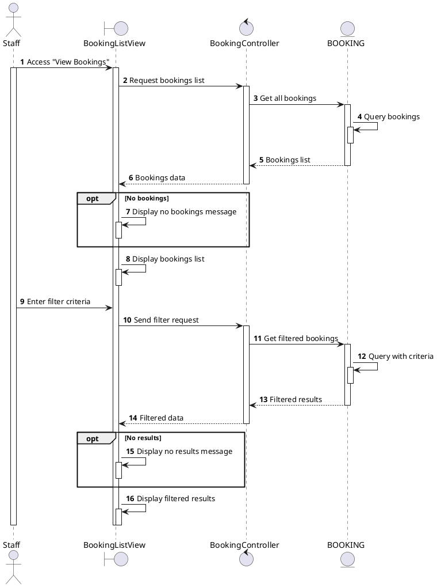

# Sequence View and Filter Bookings

```plantuml
@startuml
autonumber

actor Staff as S
boundary BookingListView as BLV
control BookingController as BC
entity BOOKING as B

S -> BLV: Access "View Bookings"
activate S
activate BLV
BLV -> BC: Request bookings list
activate BC
BC -> B: Get all bookings
activate B
B -> B: Query bookings
activate B
deactivate B

BC <-- B: Bookings list
deactivate B
BLV <-- BC: Bookings data
deactivate BC

opt No bookings
  BLV -> BLV: Display no bookings message
  activate BLV
  deactivate BLV
end

BLV -> BLV: Display bookings list
activate BLV
deactivate BLV

S -> BLV: Enter filter criteria
BLV -> BC: Send filter request
activate BC
BC -> B: Get filtered bookings
activate B
B -> B: Query with criteria
activate B
deactivate B

BC <-- B: Filtered results
deactivate B
BLV <-- BC: Filtered data
deactivate BC

opt No results
  BLV -> BLV: Display no results message
  activate BLV
  deactivate BLV
end

BLV -> BLV: Display filtered results
activate BLV
deactivate BLV

deactivate BLV
deactivate S

@enduml
```

<!-- diagram id="sequence-adjust-and-track-bookings-view-and-filter-bookings" -->
