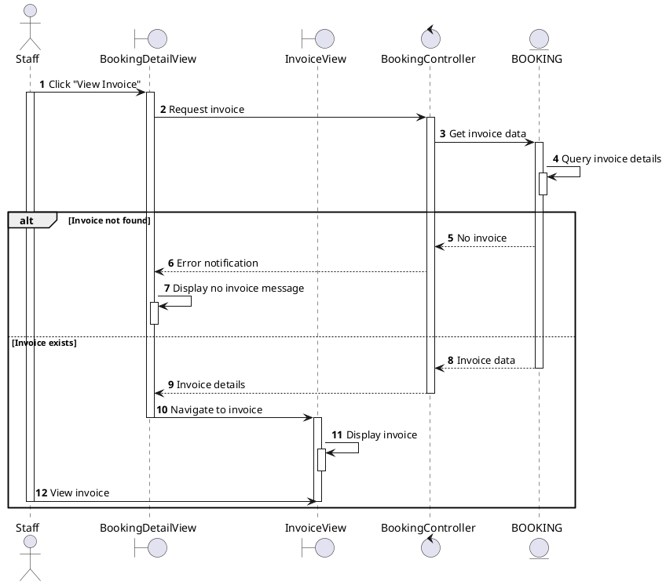

# Sequence View Booking's Invoice

```plantuml
@startuml
autonumber

actor Staff as S
boundary BookingDetailView as BDV
boundary InvoiceView as IV
control BookingController as BC
entity BOOKING as B

S -> BDV: Click "View Invoice"
activate S
activate BDV
BDV -> BC: Request invoice
activate BC
BC -> B: Get invoice data
activate B
B -> B: Query invoice details
activate B
deactivate B


alt Invoice not found
  BC <-- B: No invoice
  BDV <-- BC: Error notification
  BDV -> BDV: Display no invoice message
  activate BDV
  deactivate BDV
else Invoice exists
  BC <-- B: Invoice data
  deactivate B
  BDV <-- BC: Invoice details
  deactivate B
  deactivate BC
  BDV -> IV: Navigate to invoice
  deactivate BDV
  activate IV
  IV -> IV: Display invoice
  activate IV
  deactivate IV
  S -> IV: View invoice
  deactivate S
  deactivate IV
end

@enduml
```

<!-- diagram id="sequence-adjust-and-track-bookings-view-booking-invoice" -->
