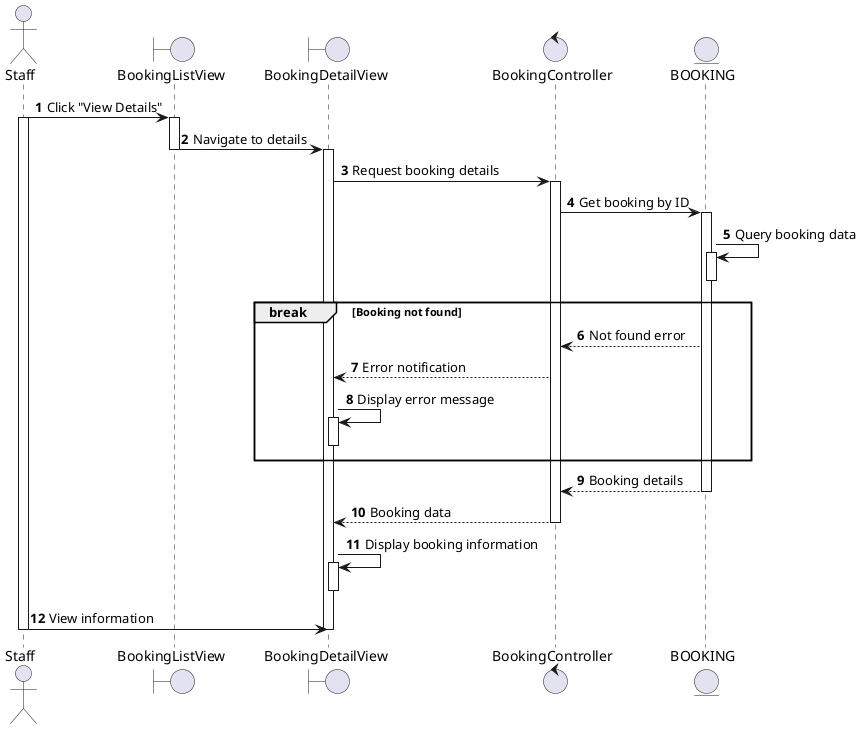

# Sequence View Booking Details

```plantuml
@startuml
autonumber

actor Staff as S
boundary BookingListView as BLV
boundary BookingDetailView as BDV
control BookingController as BC
entity BOOKING as B

S -> BLV: Click "View Details"
activate S
activate BLV
BLV -> BDV: Navigate to details
deactivate BLV
activate BDV
BDV -> BC: Request booking details
activate BC
BC -> B: Get booking by ID
activate B
B -> B: Query booking data
activate B
deactivate B

break Booking not found
  BC <-- B: Not found error
  BDV <-- BC: Error notification
  BDV -> BDV: Display error message
  activate BDV
  deactivate BDV
end

BC <-- B: Booking details
deactivate B
BDV <-- BC: Booking data
deactivate BC
BDV -> BDV: Display booking information
activate BDV
deactivate BDV

S -> BDV: View information
deactivate S
deactivate BDV

@enduml
```

<!-- diagram id="sequence-adjust-and-track-bookings-view-booking-details" -->
