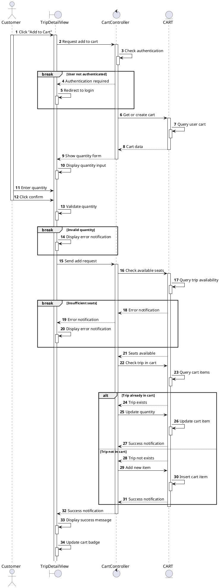

# Sequence Add Trip to Cart

```plantuml
@startuml
autonumber

actor Customer as C
boundary TripDetailView as TDV
control CartController as CC
entity CART as CA

C -> TDV: Click "Add to Cart"
activate C
activate TDV
TDV -> CC: Request add to cart
activate CC
CC -> CC: Check authentication
activate CC
deactivate CC

break User not authenticated
  TDV <-- CC: Authentication required
  TDV -> TDV: Redirect to login
  activate TDV
  deactivate TDV
end

CC -> CA: Get or create cart
activate CA
CA -> CA: Query user cart
activate CA
deactivate CA
CC <-- CA: Cart data
deactivate CA

TDV <-- CC: Show quantity form
deactivate CC
TDV -> TDV: Display quantity input
activate TDV
deactivate TDV

C -> TDV: Enter quantity
C -> TDV: Click confirm
deactivate C
TDV -> TDV: Validate quantity
activate TDV
deactivate TDV

break Invalid quantity
  TDV -> TDV: Display error notification
  activate TDV
  deactivate TDV
end

TDV -> CC: Send add request
activate CC
CC -> CA: Check available seats
activate CA
CA -> CA: Query trip availability
activate CA
deactivate CA

break Insufficient seats
  CC <-- CA: Error notification
  TDV <-- CC: Error notification
  TDV -> TDV: Display error notification
  activate TDV
  deactivate TDV
end

CC <-- CA: Seats available
CC -> CA: Check trip in cart
CA -> CA: Query cart items
activate CA
deactivate CA

alt Trip already in cart
  CC <-- CA: Trip exists
  CC -> CA: Update quantity
  CA -> CA: Update cart item
  activate CA
  deactivate CA
  CC <-- CA: Success notification
else Trip not in cart
  CC <-- CA: Trip not exists
  CC -> CA: Add new item
  CA -> CA: Insert cart item
  activate CA
  deactivate CA
  CC <-- CA: Success notification
end

deactivate CA
TDV <-- CC: Success notification
deactivate CC
TDV -> TDV: Display success message
activate TDV
deactivate TDV
TDV -> TDV: Update cart badge
activate TDV
deactivate TDV

@enduml
```

<!-- diagram id="sequence-adjust-cart-add-trip-to-cart" -->
