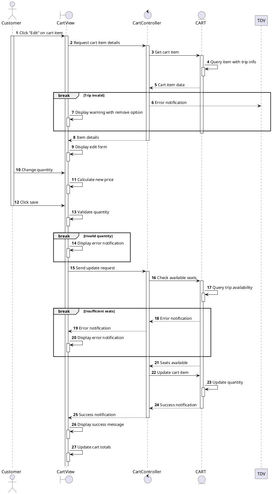

# Sequence Edit Trip Details

```plantuml
@startuml
autonumber

actor Customer as C
boundary CartView as CV
control CartController as CC
entity CART as CA

C -> CV: Click "Edit" on cart item
activate C
activate CV
CV -> CC: Request cart item details
activate CC
CC -> CA: Get cart item
activate CA
CA -> CA: Query item with trip info
activate CA
deactivate CA
CC <-- CA: Cart item data

break Trip invalid
  TDV <-- CC: Error notification
  CV -> CV: Display warning with remove option
  activate CV
  deactivate CV
end

deactivate CA
CV <-- CC: Item details
deactivate CC
CV -> CV: Display edit form
activate CV
deactivate CV

C -> CV: Change quantity
CV -> CV: Calculate new price
activate CV
deactivate CV

C -> CV: Click save
deactivate C
CV -> CV: Validate quantity
activate CV
deactivate CV

break Invalid quantity
  CV -> CV: Display error notification
  activate CV
  deactivate CV
end

CV -> CC: Send update request
activate CC
CC -> CA: Check available seats
activate CA
CA -> CA: Query trip availability
activate CA
deactivate CA

break Insufficient seats
  CC <-- CA: Error notification
  CV <-- CC: Error notification
  CV -> CV: Display error notification
  activate CV
  deactivate CV
end

CC <-- CA: Seats available
CC -> CA: Update cart item
CA -> CA: Update quantity
activate CA
deactivate CA
CC <-- CA: Success notification
deactivate CA
CV <-- CC: Success notification
deactivate CC
CV -> CV: Display success message
activate CV
deactivate CV
CV -> CV: Update cart totals
activate CV
deactivate CV

@enduml
```

<!-- diagram id="sequence-adjust-cart-edit-trip-details" -->
