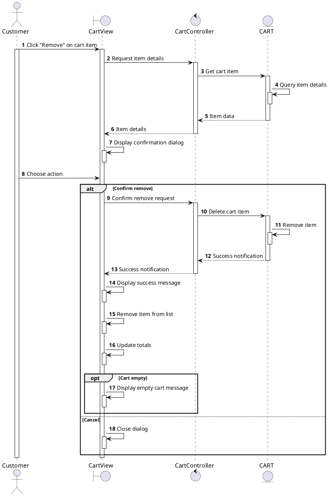

# Sequence Remove Trip from Cart

```plantuml
@startuml
autonumber

actor Customer as C
boundary CartView as CV
control CartController as CC
entity CART as CA

C -> CV: Click "Remove" on cart item
activate C
activate CV
CV -> CC: Request item details
activate CC
CC -> CA: Get cart item
activate CA
CA -> CA: Query item details
activate CA
deactivate CA
CC <-- CA: Item data
deactivate CA
CV <-- CC: Item details
deactivate CC
CV -> CV: Display confirmation dialog
activate CV
deactivate CV

C -> CV: Choose action

alt Confirm remove
  CV -> CC: Confirm remove request
  activate CC
  CC -> CA: Delete cart item
  activate CA
  CA -> CA: Remove item
  activate CA
  deactivate CA
  CC <-- CA: Success notification
  deactivate CA
  CV <-- CC: Success notification
  deactivate CC
  CV -> CV: Display success message
  activate CV
  deactivate CV
  CV -> CV: Remove item from list
  activate CV
  deactivate CV
  CV -> CV: Update totals
  activate CV
  deactivate CV

  opt Cart empty
    CV -> CV: Display empty cart message
    activate CV
    deactivate CV
  end
else Cancel
  CV -> CV: Close dialog
  activate CV
  deactivate CV
end

deactivate CV
deactivate C

@enduml
```

<!-- diagram id="sequence-adjust-cart-remove-trip-to-cart" -->
