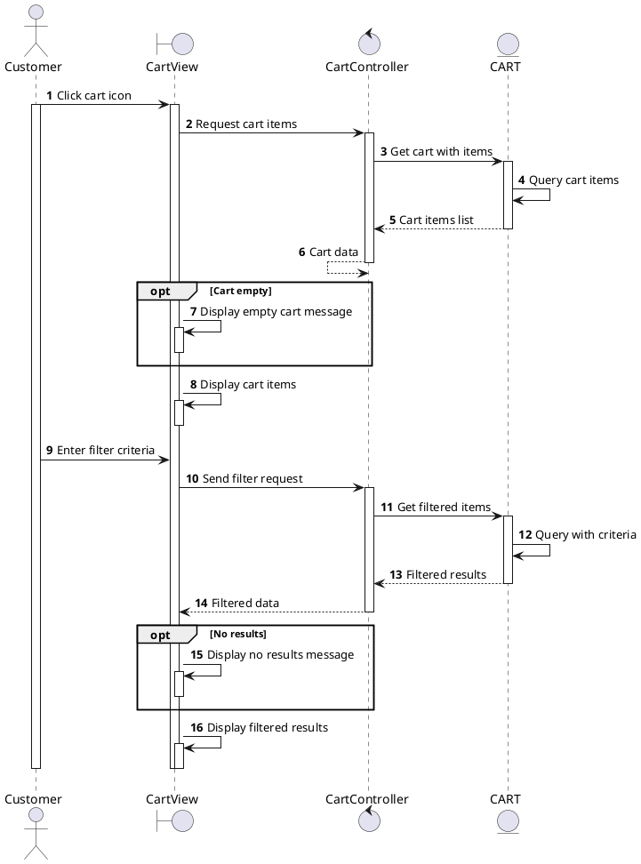

# Sequence View and Filter Trips in Cart

```plantuml
@startuml
autonumber

actor Customer as C
boundary CartView as CV
control CartController as CC
entity CART as CA

C -> CV: Click cart icon
activate C
activate CV
CV -> CC: Request cart items
activate CC
CC -> CA: Get cart with items
activate CA
CA -> CA: Query cart items
CC <-- CA: Cart items list
deactivate CA
CC <-- CC: Cart data
deactivate CC

opt Cart empty
  CV -> CV: Display empty cart message
  activate CV
  deactivate CV
end

CV -> CV: Display cart items
activate CV
deactivate CV

C -> CV: Enter filter criteria
CV -> CC: Send filter request
activate CC
CC -> CA: Get filtered items
activate CA
CA -> CA: Query with criteria
CC <-- CA: Filtered results
deactivate CA
CV <-- CC: Filtered data
deactivate CC

opt No results
  CV -> CV: Display no results message
  activate CV
  deactivate CV
end

CV -> CV: Display filtered results
activate CV
deactivate CV

deactivate CV
deactivate C

@enduml
```

<!-- diagram id="sequence-adjust-cart-view-and-filter-trips-in-cart" -->
