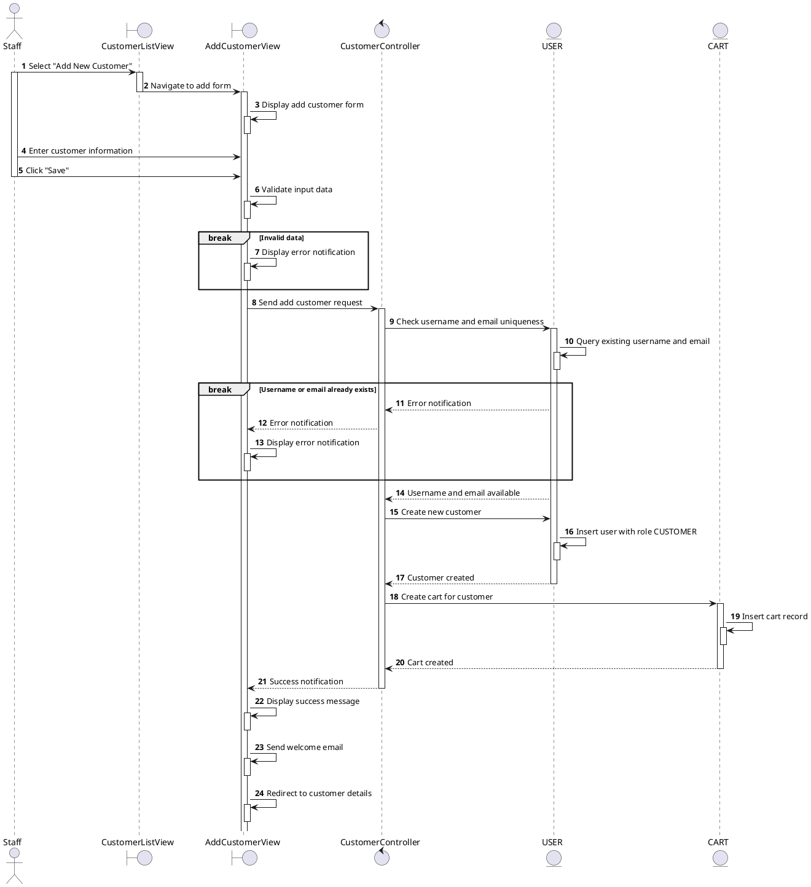

# Sequence Add New Customer

```plantuml
@startuml
autonumber

actor Staff as St
boundary CustomerListView as CLV
boundary AddCustomerView as ACV
control CustomerController as CC
entity USER as U
entity CART as C

St -> CLV: Select "Add New Customer"
activate St
activate CLV
CLV -> ACV: Navigate to add form
deactivate CLV
activate ACV
ACV -> ACV: Display add customer form
activate ACV
deactivate ACV

St -> ACV: Enter customer information
St -> ACV: Click "Save"
deactivate St
ACV -> ACV: Validate input data
activate ACV
deactivate ACV

break Invalid data
  ACV -> ACV: Display error notification
  activate ACV
  deactivate ACV
end

ACV -> CC: Send add customer request
activate CC
CC -> U: Check username and email uniqueness
activate U
U -> U: Query existing username and email
activate U
deactivate U

break Username or email already exists
  CC <-- U: Error notification
  ACV <-- CC: Error notification
  ACV -> ACV: Display error notification
  activate ACV
  deactivate ACV
end

CC <-- U: Username and email available
CC -> U: Create new customer
U -> U: Insert user with role CUSTOMER
activate U
deactivate U
CC <-- U: Customer created
deactivate U

CC -> C: Create cart for customer
activate C
C -> C: Insert cart record
activate C
deactivate C
CC <-- C: Cart created
deactivate C

ACV <-- CC: Success notification
deactivate CC
ACV -> ACV: Display success message
activate ACV
deactivate ACV
ACV -> ACV: Send welcome email
activate ACV
deactivate ACV
ACV -> ACV: Redirect to customer details
activate ACV
deactivate ACV

@enduml
```

<!-- diagram id="sequence-adjust-customers-add-new-customer" -->
