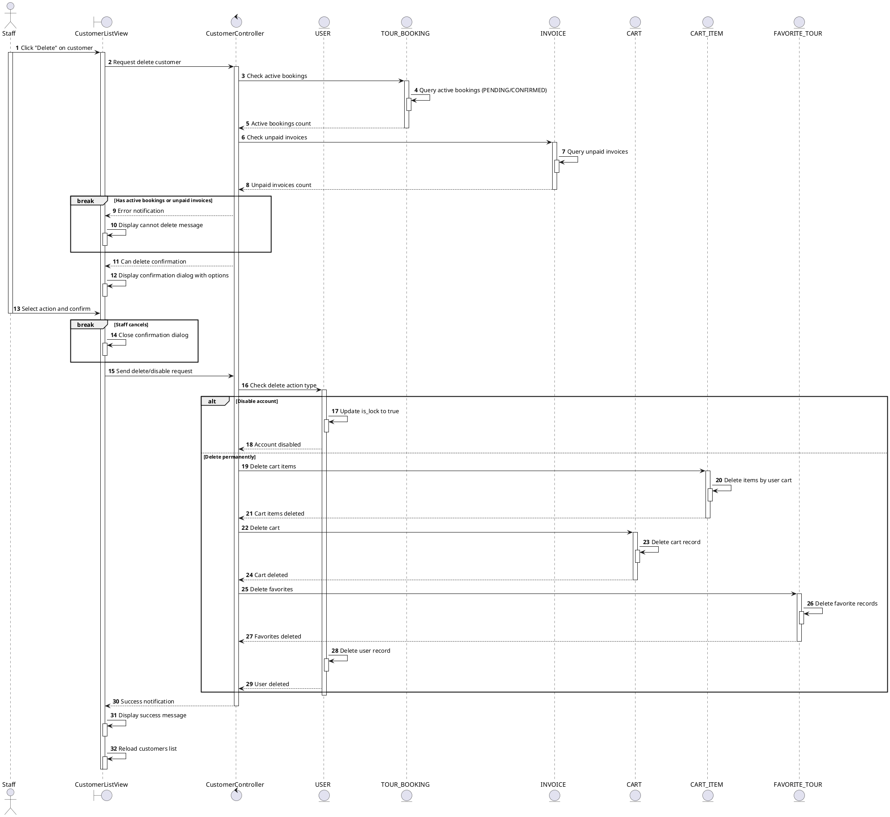

# Sequence Delete Customer

```plantuml
@startuml
autonumber

actor Staff as St
boundary CustomerListView as CLV
control CustomerController as CC
entity USER as U
entity TOUR_BOOKING as TB
entity INVOICE as I
entity CART as C
entity CART_ITEM as CI
entity FAVORITE_TOUR as FT

St -> CLV: Click "Delete" on customer
activate St
activate CLV
CLV -> CC: Request delete customer
activate CC
CC -> TB: Check active bookings
activate TB
TB -> TB: Query active bookings (PENDING/CONFIRMED)
activate TB
deactivate TB
CC <-- TB: Active bookings count
deactivate TB

CC -> I: Check unpaid invoices
activate I
I -> I: Query unpaid invoices
activate I
deactivate I
CC <-- I: Unpaid invoices count
deactivate I

break Has active bookings or unpaid invoices
  CLV <-- CC: Error notification
  CLV -> CLV: Display cannot delete message
  activate CLV
  deactivate CLV
end

CLV <-- CC: Can delete confirmation
CLV -> CLV: Display confirmation dialog with options
activate CLV
deactivate CLV

St -> CLV: Select action and confirm
deactivate St

break Staff cancels
  CLV -> CLV: Close confirmation dialog
  activate CLV
  deactivate CLV
end

CLV -> CC: Send delete/disable request
CC -> U: Check delete action type
activate U

alt Disable account
  U -> U: Update is_lock to true
  activate U
  deactivate U
  CC <-- U: Account disabled
else Delete permanently
  CC -> CI: Delete cart items
  activate CI
  CI -> CI: Delete items by user cart
  activate CI
  deactivate CI
  CC <-- CI: Cart items deleted
  deactivate CI

  CC -> C: Delete cart
  activate C
  C -> C: Delete cart record
  activate C
  deactivate C
  CC <-- C: Cart deleted
  deactivate C

  CC -> FT: Delete favorites
  activate FT
  FT -> FT: Delete favorite records
  activate FT
  deactivate FT
  CC <-- FT: Favorites deleted
  deactivate FT

  U -> U: Delete user record
  activate U
  deactivate U
  CC <-- U: User deleted
end

deactivate U

CLV <-- CC: Success notification
deactivate CC
CLV -> CLV: Display success message
activate CLV
deactivate CLV
CLV -> CLV: Reload customers list
activate CLV
deactivate CLV

deactivate CLV

@enduml
```

<!-- diagram id="sequence-adjust-customers-delete-customer" -->
