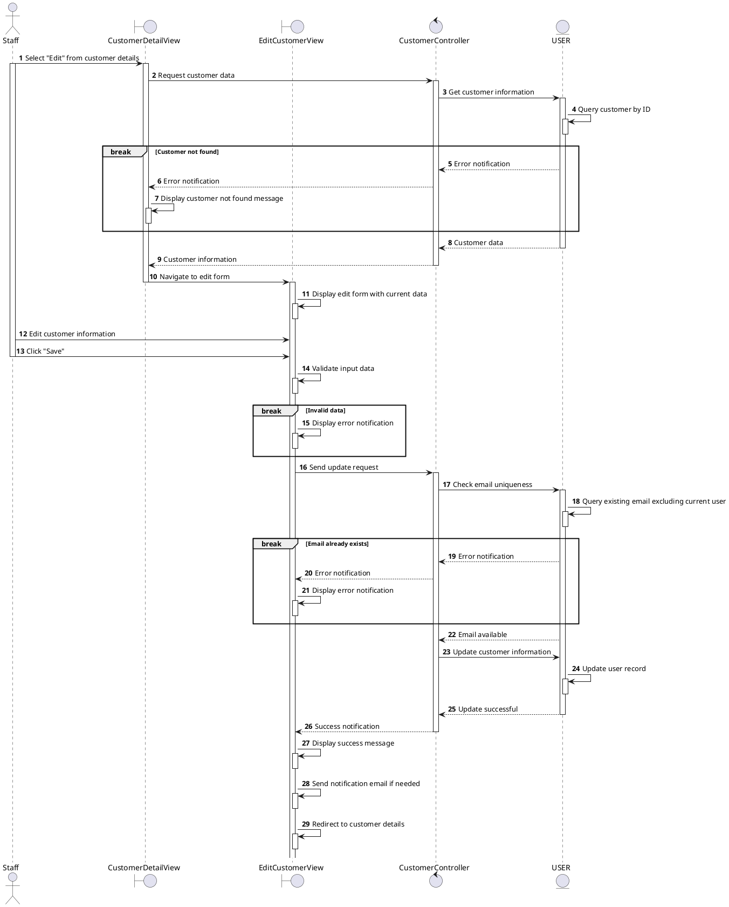

# Sequence Edit Customer

```plantuml
@startuml
autonumber

actor Staff as St
boundary CustomerDetailView as CDV
boundary EditCustomerView as ECV
control CustomerController as CC
entity USER as U

St -> CDV: Select "Edit" from customer details
activate St
activate CDV
CDV -> CC: Request customer data
activate CC
CC -> U: Get customer information
activate U
U -> U: Query customer by ID
activate U
deactivate U

break Customer not found
  CC <-- U: Error notification
  CDV <-- CC: Error notification
  CDV -> CDV: Display customer not found message
  activate CDV
  deactivate CDV
end

CC <-- U: Customer data
deactivate U
CDV <-- CC: Customer information
deactivate CC
CDV -> ECV: Navigate to edit form
deactivate CDV
activate ECV
ECV -> ECV: Display edit form with current data
activate ECV
deactivate ECV

St -> ECV: Edit customer information
St -> ECV: Click "Save"
deactivate St
ECV -> ECV: Validate input data
activate ECV
deactivate ECV

break Invalid data
  ECV -> ECV: Display error notification
  activate ECV
  deactivate ECV
end

ECV -> CC: Send update request
activate CC
CC -> U: Check email uniqueness
activate U
U -> U: Query existing email excluding current user
activate U
deactivate U

break Email already exists
  CC <-- U: Error notification
  ECV <-- CC: Error notification
  ECV -> ECV: Display error notification
  activate ECV
  deactivate ECV
end

CC <-- U: Email available
CC -> U: Update customer information
U -> U: Update user record
activate U
deactivate U
CC <-- U: Update successful
deactivate U

ECV <-- CC: Success notification
deactivate CC
ECV -> ECV: Display success message
activate ECV
deactivate ECV
ECV -> ECV: Send notification email if needed
activate ECV
deactivate ECV
ECV -> ECV: Redirect to customer details
activate ECV
deactivate ECV

@enduml
```

<!-- diagram id="sequence-adjust-customers-edit-customer" -->
