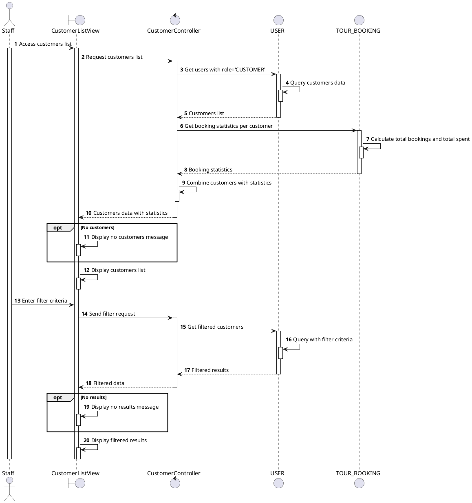

# Sequence View and Filter Customers

```plantuml
@startuml
autonumber

actor Staff as St
boundary CustomerListView as CLV
control CustomerController as CC
entity USER as U
entity TOUR_BOOKING as TB

St -> CLV: Access customers list
activate St
activate CLV
CLV -> CC: Request customers list
activate CC
CC -> U: Get users with role='CUSTOMER'
activate U
U -> U: Query customers data
activate U
deactivate U
CC <-- U: Customers list
deactivate U
CC -> TB: Get booking statistics per customer
activate TB
TB -> TB: Calculate total bookings and total spent
activate TB
deactivate TB
CC <-- TB: Booking statistics
deactivate TB
CC -> CC: Combine customers with statistics
activate CC
deactivate CC
CLV <-- CC: Customers data with statistics
deactivate CC

opt No customers
  CLV -> CLV: Display no customers message
  activate CLV
  deactivate CLV
end

CLV -> CLV: Display customers list
activate CLV
deactivate CLV

St -> CLV: Enter filter criteria
CLV -> CC: Send filter request
activate CC
CC -> U: Get filtered customers
activate U
U -> U: Query with filter criteria
activate U
deactivate U
CC <-- U: Filtered results
deactivate U
CLV <-- CC: Filtered data
deactivate CC

opt No results
  CLV -> CLV: Display no results message
  activate CLV
  deactivate CLV
end

CLV -> CLV: Display filtered results
activate CLV
deactivate CLV

deactivate CLV
deactivate St

@enduml
```

<!-- diagram id="sequence-adjust-customers-view-and-filter-customers" -->
