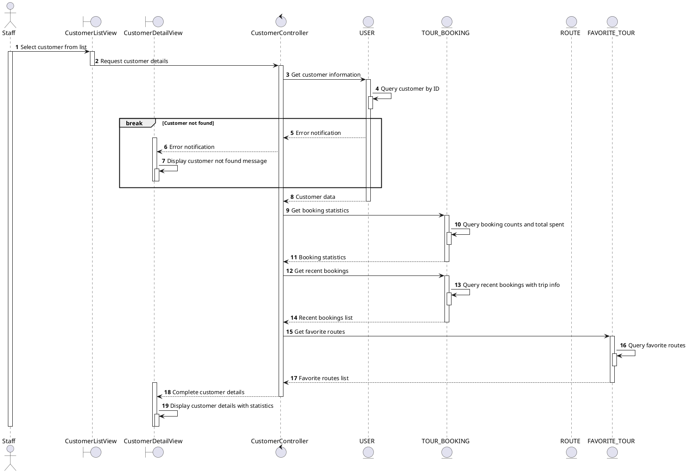

# Sequence View Customer Details

```plantuml
@startuml
autonumber

actor Staff as St
boundary CustomerListView as CLV
boundary CustomerDetailView as CDV
control CustomerController as CC
entity USER as U
entity TOUR_BOOKING as TB
entity ROUTE as R
entity FAVORITE_TOUR as FT

St -> CLV: Select customer from list
activate St
activate CLV
CLV -> CC: Request customer details
deactivate CLV
activate CC
CC -> U: Get customer information
activate U
U -> U: Query customer by ID
activate U
deactivate U

break Customer not found
  CC <-- U: Error notification
  activate CDV
  CDV <-- CC: Error notification
  CDV -> CDV: Display customer not found message
  activate CDV
  deactivate CDV
  deactivate CDV
end

CC <-- U: Customer data
deactivate U

CC -> TB: Get booking statistics
activate TB
TB -> TB: Query booking counts and total spent
activate TB
deactivate TB
CC <-- TB: Booking statistics
deactivate TB

CC -> TB: Get recent bookings
activate TB
TB -> TB: Query recent bookings with trip info
activate TB
deactivate TB
CC <-- TB: Recent bookings list
deactivate TB

CC -> FT: Get favorite routes
activate FT
FT -> FT: Query favorite routes
activate FT
deactivate FT
CC <-- FT: Favorite routes list
deactivate FT

activate CDV
CDV <-- CC: Complete customer details
deactivate CC
CDV -> CDV: Display customer details with statistics
activate CDV
deactivate CDV

deactivate CDV
deactivate St

@enduml
```

<!-- diagram id="sequence-adjust-customers-view-customer-details" -->
