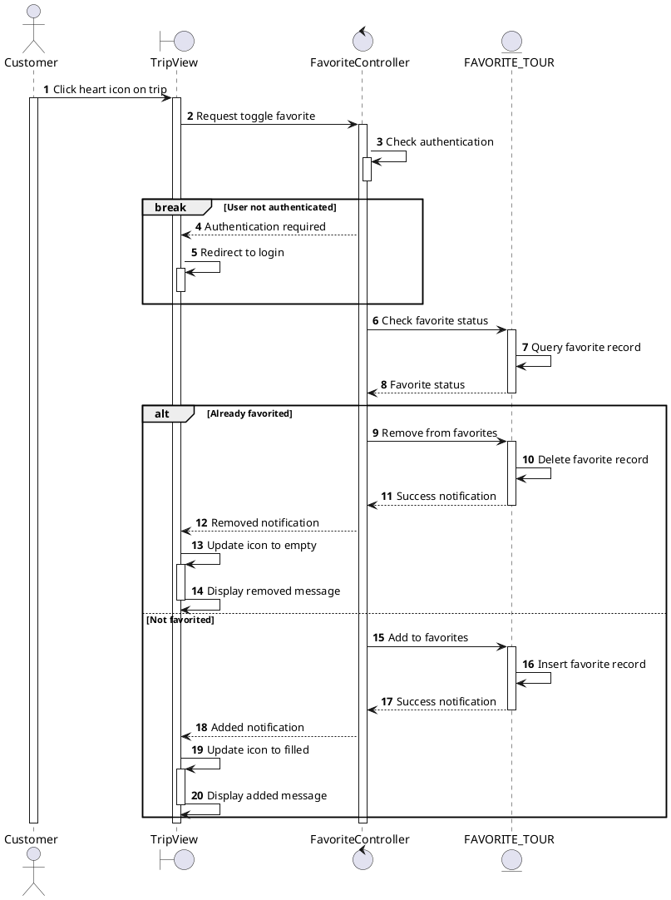

# Sequence Toggle Favorite Trip

```plantuml
@startuml
autonumber

actor Customer as C
boundary TripView as TV
control FavoriteController as FC
entity FAVORITE_TOUR as FT

C -> TV: Click heart icon on trip
activate C
activate TV
TV -> FC: Request toggle favorite
activate FC
FC -> FC: Check authentication
activate FC
deactivate FC

break User not authenticated
  TV <-- FC: Authentication required
  TV -> TV: Redirect to login
  activate TV
  deactivate TV
end

FC -> FT: Check favorite status
activate FT
FT -> FT: Query favorite record
FC <-- FT: Favorite status
deactivate FT

alt Already favorited
  FC -> FT: Remove from favorites
  activate FT
  FT -> FT: Delete favorite record
  FC <-- FT: Success notification
  deactivate FT
  TV <-- FC: Removed notification
  TV -> TV: Update icon to empty
  activate TV
  TV -> TV: Display removed message
  deactivate TV
else Not favorited
  FC -> FT: Add to favorites
  activate FT
  FT -> FT: Insert favorite record
  FC <-- FT: Success notification
  deactivate FT
  TV <-- FC: Added notification
  TV -> TV: Update icon to filled
  activate TV
  TV -> TV: Display added message
  deactivate TV
end

deactivate FC
deactivate TV
deactivate C

@enduml
```

<!-- diagram id="sequence-adjust-favorite-trips-toggle-favorite-trip" -->
