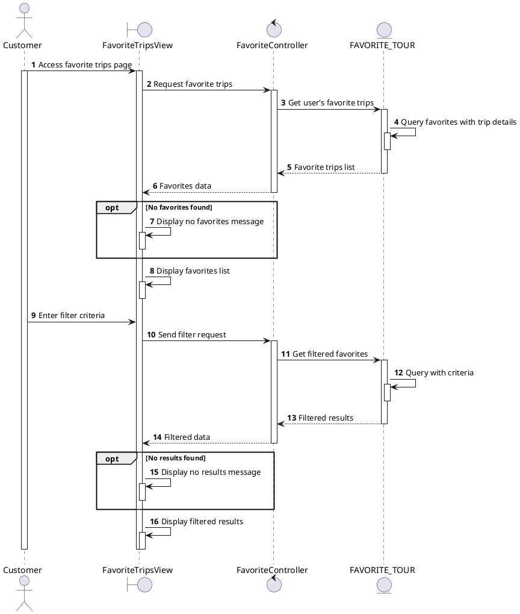

# Sequence View and Filter Favorite Trips

```plantuml
@startuml
autonumber

actor Customer as C
boundary FavoriteTripsView as FTV
control FavoriteController as FC
entity FAVORITE_TOUR as FT

C -> FTV: Access favorite trips page
activate C
activate FTV
FTV -> FC: Request favorite trips
activate FC
FC -> FT: Get user's favorite trips
activate FT
FT -> FT: Query favorites with trip details
activate FT
deactivate FT
FC <-- FT: Favorite trips list
deactivate FT
FTV <-- FC: Favorites data
deactivate FC

opt No favorites found
  FTV -> FTV: Display no favorites message
  activate FTV
  deactivate FTV
end

FTV -> FTV: Display favorites list
activate FTV
deactivate FTV

C -> FTV: Enter filter criteria
FTV -> FC: Send filter request
activate FC
FC -> FT: Get filtered favorites
activate FT
FT -> FT: Query with criteria
activate FT
deactivate FT
FC <-- FT: Filtered results
deactivate FT
FTV <-- FC: Filtered data
deactivate FC

opt No results found
  FTV -> FTV: Display no results message
  activate FTV
  deactivate FTV
end

FTV -> FTV: Display filtered results
activate FTV
deactivate FTV

deactivate FTV
deactivate C

@enduml
```

<!-- diagram id="sequence-adjust-favorite-trips-view-and-filter-favorite-trips" -->
