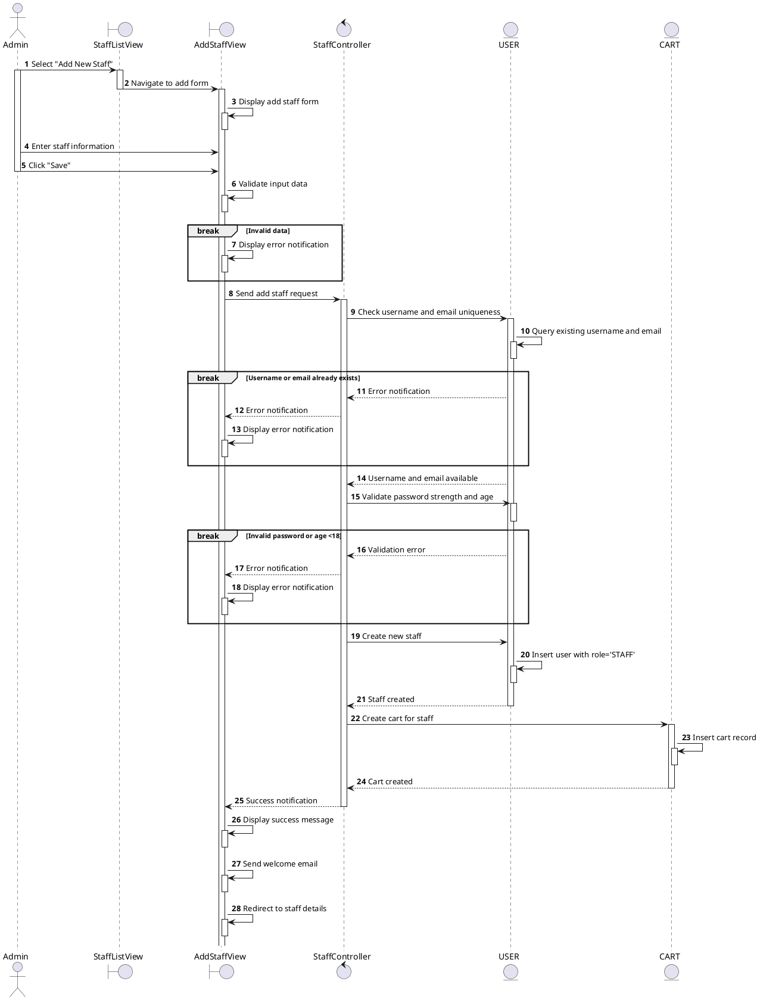

# Sequence Add New Staff

```plantuml
@startuml
autonumber

actor Admin as A
boundary StaffListView as SLV
boundary AddStaffView as ASV
control StaffController as SC
entity USER as U
entity CART as C

A -> SLV: Select "Add New Staff"
activate A
activate SLV
SLV -> ASV: Navigate to add form
deactivate SLV
activate ASV
ASV -> ASV: Display add staff form
activate ASV
deactivate ASV

A -> ASV: Enter staff information
A -> ASV: Click "Save"
deactivate A
ASV -> ASV: Validate input data
activate ASV
deactivate ASV

break Invalid data
  ASV -> ASV: Display error notification
  activate ASV
  deactivate ASV
end

ASV -> SC: Send add staff request
activate SC
SC -> U: Check username and email uniqueness
activate U
U -> U: Query existing username and email
activate U
deactivate U

break Username or email already exists
  SC <-- U: Error notification
  ASV <-- SC: Error notification
  ASV -> ASV: Display error notification
  activate ASV
  deactivate ASV
end

SC <-- U: Username and email available
SC -> U: Validate password strength and age
activate U
deactivate U

break Invalid password or age <18
  SC <-- U: Validation error
  ASV <-- SC: Error notification
  ASV -> ASV: Display error notification
  activate ASV
  deactivate ASV
end

SC -> U: Create new staff
U -> U: Insert user with role='STAFF'
activate U
deactivate U
SC <-- U: Staff created
deactivate U

SC -> C: Create cart for staff
activate C
C -> C: Insert cart record
activate C
deactivate C
SC <-- C: Cart created
deactivate C

ASV <-- SC: Success notification
deactivate SC
ASV -> ASV: Display success message
activate ASV
deactivate ASV
ASV -> ASV: Send welcome email
activate ASV
deactivate ASV
ASV -> ASV: Redirect to staff details
activate ASV
deactivate ASV

@enduml
```

<!-- diagram id="sequence-adjust-staffs-add-new-staff" -->
