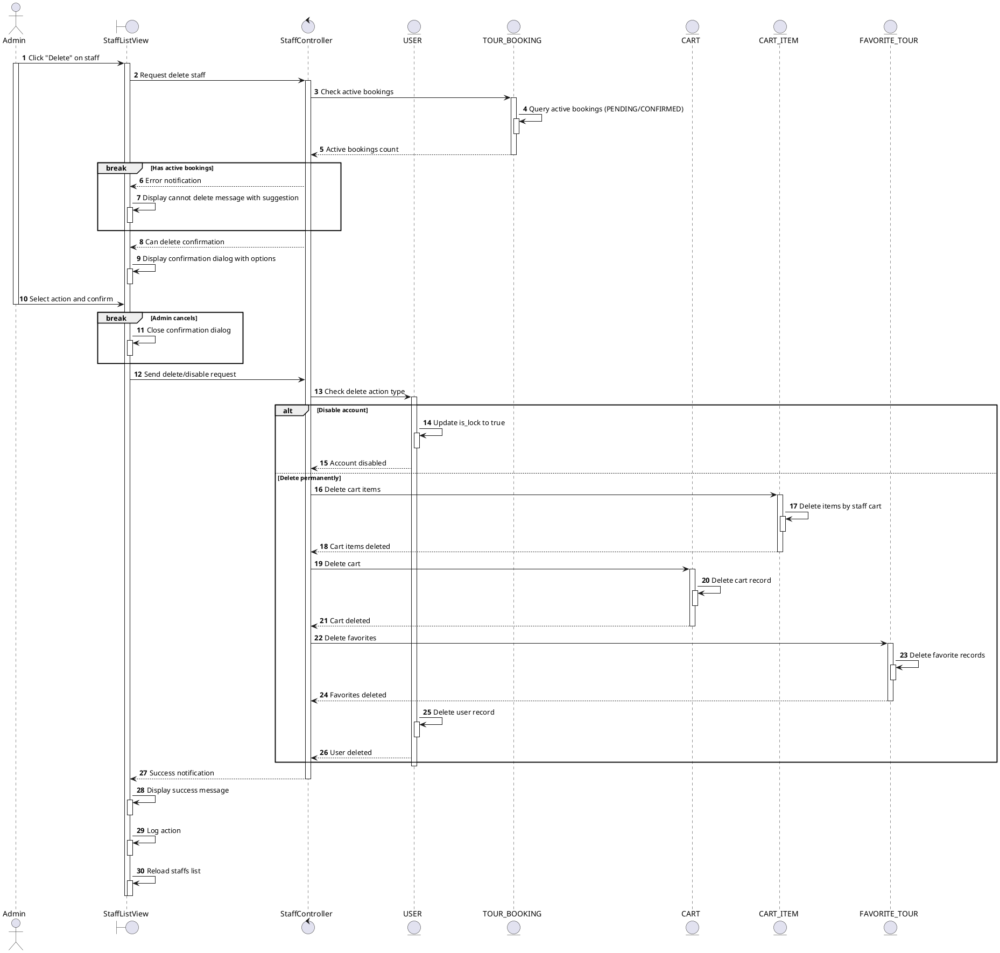

# Sequence Delete Staff

```plantuml
@startuml
autonumber

actor Admin as A
boundary StaffListView as SLV
control StaffController as SC
entity USER as U
entity TOUR_BOOKING as TB
entity CART as C
entity CART_ITEM as CI
entity FAVORITE_TOUR as FT

A -> SLV: Click "Delete" on staff
activate A
activate SLV
SLV -> SC: Request delete staff
activate SC
SC -> TB: Check active bookings
activate TB
TB -> TB: Query active bookings (PENDING/CONFIRMED)
activate TB
deactivate TB
SC <-- TB: Active bookings count
deactivate TB

break Has active bookings
  SLV <-- SC: Error notification
  SLV -> SLV: Display cannot delete message with suggestion
  activate SLV
  deactivate SLV
end

SLV <-- SC: Can delete confirmation
SLV -> SLV: Display confirmation dialog with options
activate SLV
deactivate SLV

A -> SLV: Select action and confirm
deactivate A

break Admin cancels
  SLV -> SLV: Close confirmation dialog
  activate SLV
  deactivate SLV
end

SLV -> SC: Send delete/disable request
SC -> U: Check delete action type
activate U

alt Disable account
  U -> U: Update is_lock to true
  activate U
  deactivate U
  SC <-- U: Account disabled
else Delete permanently
  SC -> CI: Delete cart items
  activate CI
  CI -> CI: Delete items by staff cart
  activate CI
  deactivate CI
  SC <-- CI: Cart items deleted
  deactivate CI

  SC -> C: Delete cart
  activate C
  C -> C: Delete cart record
  activate C
  deactivate C
  SC <-- C: Cart deleted
  deactivate C

  SC -> FT: Delete favorites
  activate FT
  FT -> FT: Delete favorite records
  activate FT
  deactivate FT
  SC <-- FT: Favorites deleted
  deactivate FT

  U -> U: Delete user record
  activate U
  deactivate U
  SC <-- U: User deleted
end

deactivate U

SLV <-- SC: Success notification
deactivate SC
SLV -> SLV: Display success message
activate SLV
deactivate SLV
SLV -> SLV: Log action
activate SLV
deactivate SLV
SLV -> SLV: Reload staffs list
activate SLV
deactivate SLV

deactivate SLV

@enduml
```

<!-- diagram id="sequence-adjust-staffs-delete-staff" -->
