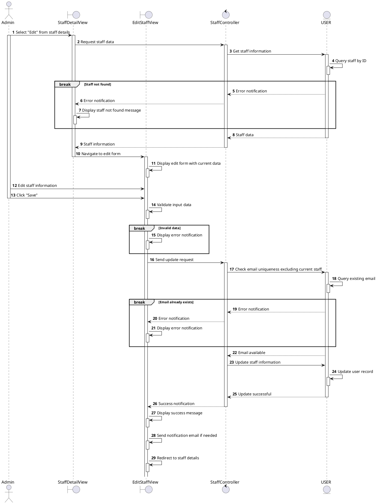

# Sequence Edit Staff

```plantuml
@startuml
autonumber

actor Admin as A
boundary StaffDetailView as SDV
boundary EditStaffView as ESV
control StaffController as SC
entity USER as U

A -> SDV: Select "Edit" from staff details
activate A
activate SDV
SDV -> SC: Request staff data
activate SC
SC -> U: Get staff information
activate U
U -> U: Query staff by ID
activate U
deactivate U

break Staff not found
  SC <-- U: Error notification
  SDV <-- SC: Error notification
  SDV -> SDV: Display staff not found message
  activate SDV
  deactivate SDV
end

SC <-- U: Staff data
deactivate U
SDV <-- SC: Staff information
deactivate SC
SDV -> ESV: Navigate to edit form
deactivate SDV
activate ESV
ESV -> ESV: Display edit form with current data
activate ESV
deactivate ESV

A -> ESV: Edit staff information
A -> ESV: Click "Save"
deactivate A
ESV -> ESV: Validate input data
activate ESV
deactivate ESV

break Invalid data
  ESV -> ESV: Display error notification
  activate ESV
  deactivate ESV
end

ESV -> SC: Send update request
activate SC
SC -> U: Check email uniqueness excluding current staff
activate U
U -> U: Query existing email
activate U
deactivate U

break Email already exists
  SC <-- U: Error notification
  ESV <-- SC: Error notification
  ESV -> ESV: Display error notification
  activate ESV
  deactivate ESV
end

SC <-- U: Email available
SC -> U: Update staff information
U -> U: Update user record
activate U
deactivate U
SC <-- U: Update successful
deactivate U

ESV <-- SC: Success notification
deactivate SC
ESV -> ESV: Display success message
activate ESV
deactivate ESV
ESV -> ESV: Send notification email if needed
activate ESV
deactivate ESV
ESV -> ESV: Redirect to staff details
activate ESV
deactivate ESV

@enduml
```

<!-- diagram id="sequence-adjust-staffs-edit-staff" -->
