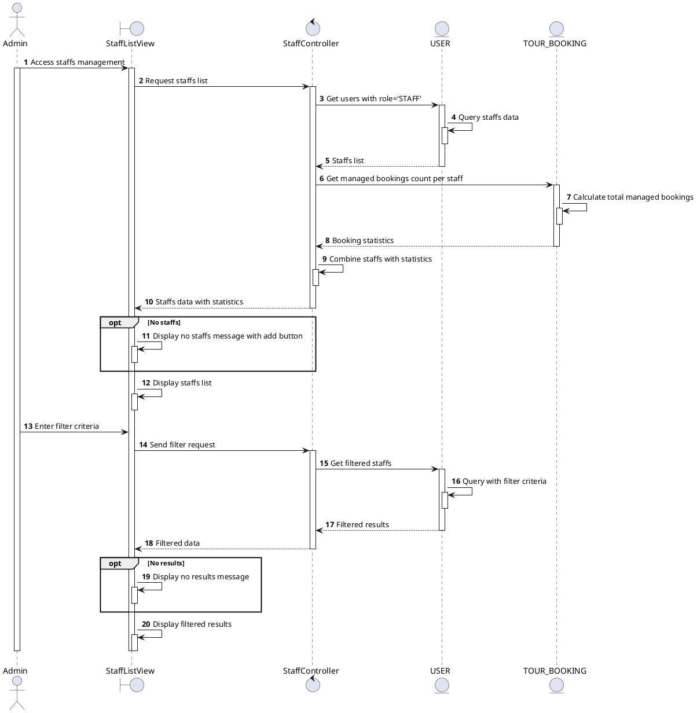

# Sequence View and Filter Staffs

```plantuml
@startuml
autonumber

actor Admin as A
boundary StaffListView as SLV
control StaffController as SC
entity USER as U
entity TOUR_BOOKING as TB

A -> SLV: Access staffs management
activate A
activate SLV
SLV -> SC: Request staffs list
activate SC
SC -> U: Get users with role='STAFF'
activate U
U -> U: Query staffs data
activate U
deactivate U
SC <-- U: Staffs list
deactivate U
SC -> TB: Get managed bookings count per staff
activate TB
TB -> TB: Calculate total managed bookings
activate TB
deactivate TB
SC <-- TB: Booking statistics
deactivate TB
SC -> SC: Combine staffs with statistics
activate SC
deactivate SC
SLV <-- SC: Staffs data with statistics
deactivate SC

opt No staffs
  SLV -> SLV: Display no staffs message with add button
  activate SLV
  deactivate SLV
end

SLV -> SLV: Display staffs list
activate SLV
deactivate SLV

A -> SLV: Enter filter criteria
SLV -> SC: Send filter request
activate SC
SC -> U: Get filtered staffs
activate U
U -> U: Query with filter criteria
activate U
deactivate U
SC <-- U: Filtered results
deactivate U
SLV <-- SC: Filtered data
deactivate SC

opt No results
  SLV -> SLV: Display no results message
  activate SLV
  deactivate SLV
end

SLV -> SLV: Display filtered results
activate SLV
deactivate SLV

deactivate SLV
deactivate A

@enduml
```

<!-- diagram id="sequence-adjust-staffs-view-and-filter-staffs" -->
