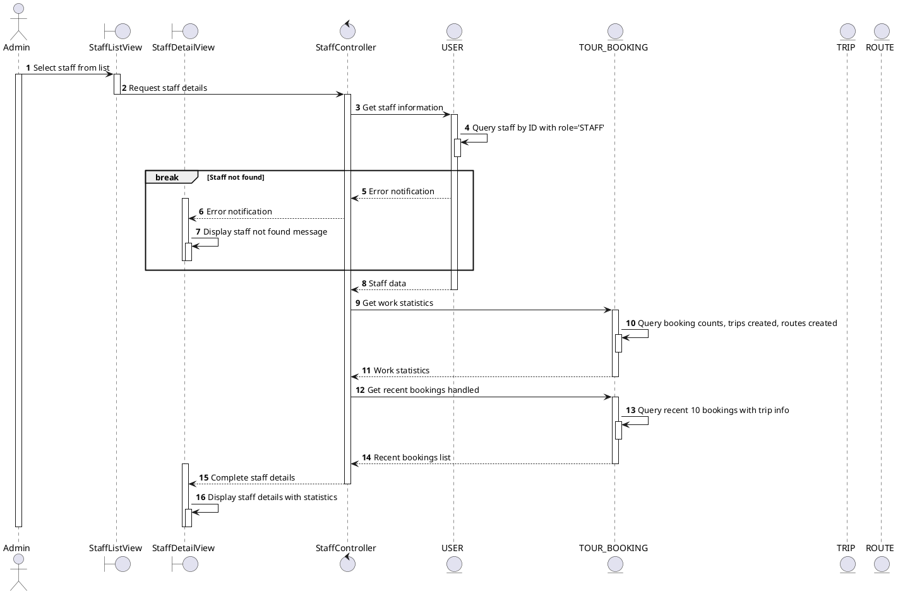

# Sequence View Staff Details

```plantuml
@startuml
autonumber

actor Admin as A
boundary StaffListView as SLV
boundary StaffDetailView as SDV
control StaffController as SC
entity USER as U
entity TOUR_BOOKING as TB
entity TRIP as T
entity ROUTE as R

A -> SLV: Select staff from list
activate A
activate SLV
SLV -> SC: Request staff details
deactivate SLV
activate SC
SC -> U: Get staff information
activate U
U -> U: Query staff by ID with role='STAFF'
activate U
deactivate U

break Staff not found
  SC <-- U: Error notification
  activate SDV
  SDV <-- SC: Error notification
  SDV -> SDV: Display staff not found message
  activate SDV
  deactivate SDV
  deactivate SDV
end

SC <-- U: Staff data
deactivate U

SC -> TB: Get work statistics
activate TB
TB -> TB: Query booking counts, trips created, routes created
activate TB
deactivate TB
SC <-- TB: Work statistics
deactivate TB

SC -> TB: Get recent bookings handled
activate TB
TB -> TB: Query recent 10 bookings with trip info
activate TB
deactivate TB
SC <-- TB: Recent bookings list
deactivate TB

activate SDV
SDV <-- SC: Complete staff details
deactivate SC
SDV -> SDV: Display staff details with statistics
activate SDV
deactivate SDV

deactivate SDV
deactivate A

@enduml
```

<!-- diagram id="sequence-adjust-staffs-view-staff-details" -->
